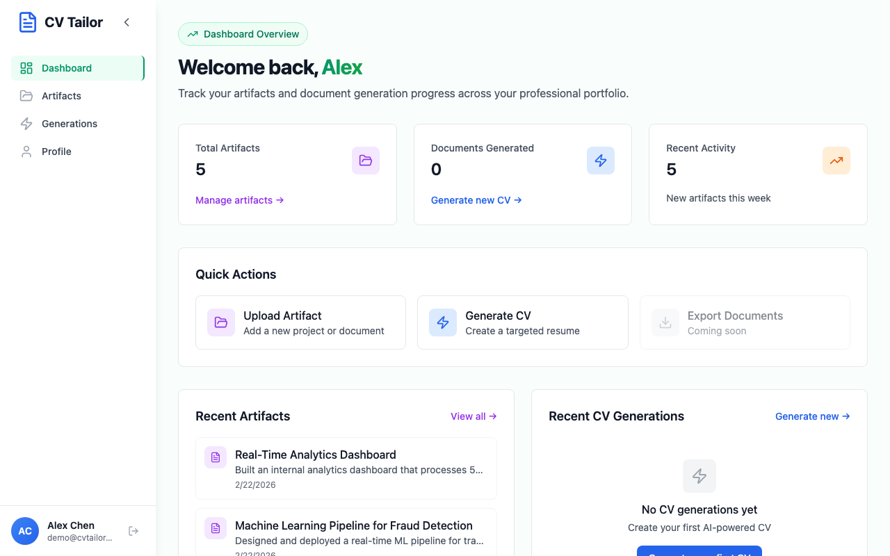
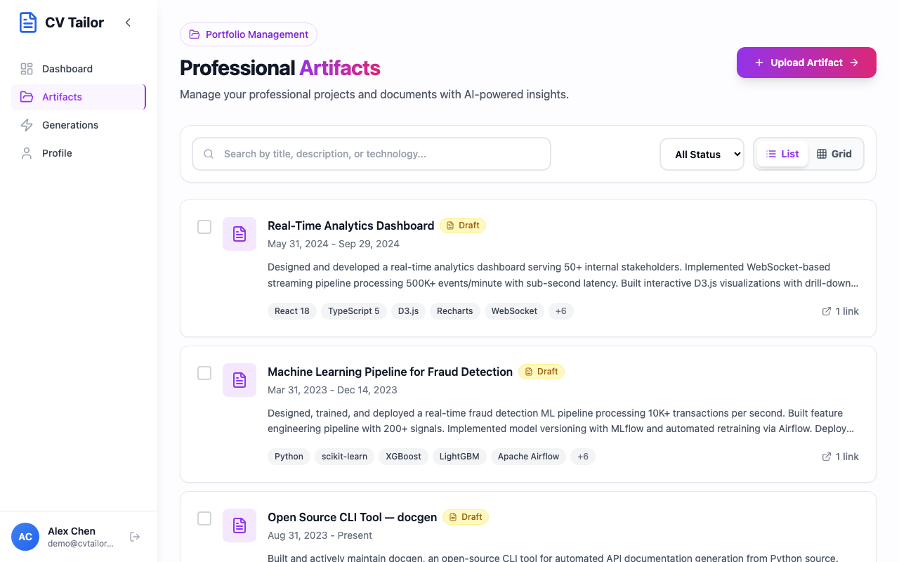
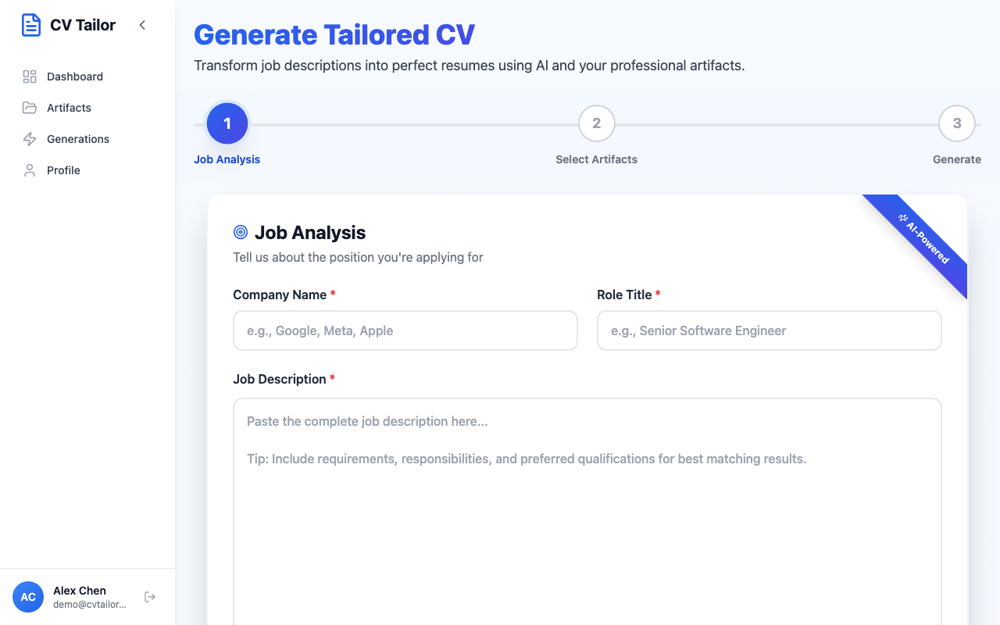
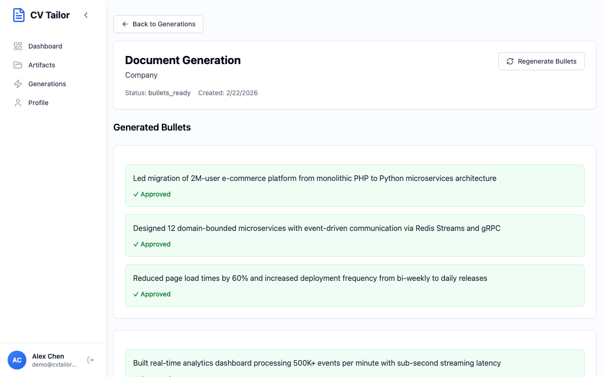
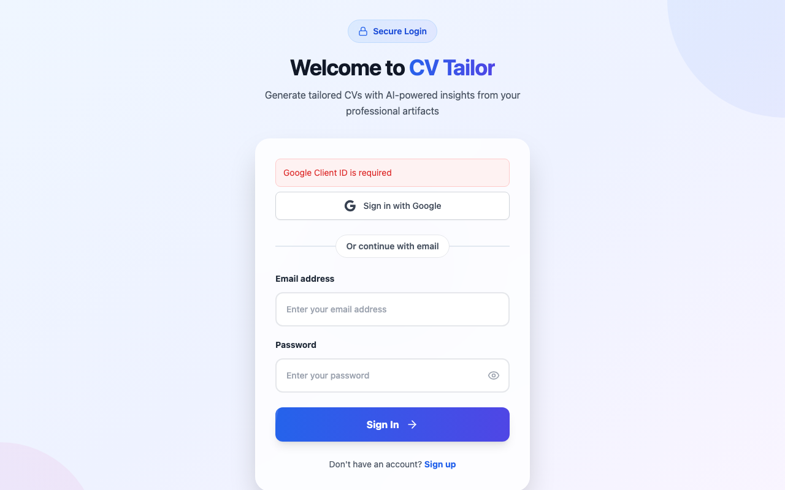

# CV Tailor

**AI-powered CV and cover letter generation from your work artifacts.**

[](https://www.python.org/)
[](https://www.djangoproject.com/)
[](https://reactjs.org/)
[](https://www.typescriptlang.org/)
[](https://www.postgresql.org/)
[](https://redis.io/)
[](https://openai.com/)
[](https://aws.amazon.com/)
[](LICENSE)

## Overview

CV Tailor is a full-stack application that transforms your work artifacts — GitHub repositories, PDFs, project documents, and web content — into tailored, job-specific CVs and cover letters using LLM processing. Upload evidence of your work, describe the target role, and receive polished, export-ready documents with AI-generated bullet points grounded in your actual accomplishments.

Built with a Django REST API backend and React frontend, the system features a layered service architecture with circuit breaker fault tolerance, async task processing, and a docs-first TDD development methodology.

## Demo

| | |
|---|---|
|  |  |
| **Dashboard** — Stats cards, quick actions, and recent artifacts at a glance. | **Artifacts** — Grid of enriched work artifacts with technology badges. |
|  |  |
| **Generate** — Paste a job description and select relevant artifacts. | **Bullet Review** — Approve, edit, or regenerate individual bullets with quality scores. |

| |
|---|
|  |
| **Login** — Clean auth form with Google OAuth integration. |

## Key Features

- **Multi-Source Artifact Ingestion** — Upload PDFs, link GitHub repos, paste web URLs, or enter text directly. LangChain processes all formats into structured evidence.
- **AI-Powered Content Extraction** — GPT-5 series models extract key accomplishments, technologies, and metrics from raw artifacts with anti-hallucination verification.
- **Job-Tailored Generation** — Paste a job description and the system ranks your artifacts by relevance, then generates role-specific bullet points.
- **Evidence-Grounded Bullets** — Every generated bullet links back to source artifacts with confidence scores, preventing fabrication.
- **Interactive Review Workflow** — Preview, edit, approve, or regenerate individual bullets before finalizing your CV.
- **Multi-Format Export** — Export polished documents as PDF or DOCX with template selection.
- **Google OAuth + JWT Auth** — Secure authentication with Google Sign-In and token-based API access.
- **Circuit Breaker Reliability** — Automatic failure detection and recovery for external LLM API calls with performance tracking.

## How It Works

```
  Upload         AI           Paste Job       Review        Export
  Artifacts → Enrichment → Description →     Bullets →      CV
```

1. **Upload Artifacts** — Add GitHub repos, PDFs, or project descriptions as evidence of your work.
2. **AI Enrichment** — LLMs extract technologies, achievements, and metrics from your raw artifacts.
3. **Paste Job Description** — Provide the target role; the system ranks artifacts by relevance.
4. **Review Bullets** — Three evidence-grounded bullet points per artifact with quality scores. Approve, edit, or regenerate.
5. **Export CV** — Download your tailored CV as PDF or DOCX with professional templates.

## Architecture

```
                       GitHub Actions (CI/CD)
                   ┌─────────────┬──────────────┐
                   │ lint/test   │ build/deploy │
                   └──────┬──────┴──────┬───────┘
                          │             │
        ┌─────────────────▼─┐   ┌───────▼──────────────────────┐
        │  S3 + CloudFront  │   │  ECS Fargate                 │
        │  (static hosting) │   │  (containers)                │
        └─────────┬─────────┘   └───────┬──────────────────────┘
                  │                     │
┌─────────────────▼─────────────────────▼──────────────────────────┐
│                                                                  │
│  ┌────────────────────────────────────────────────────────────┐  │
│  │  Frontend (React 18)                                       │  │
│  │  TypeScript · Tailwind CSS · Radix UI · Zustand · Axios    │  │
│  └──────────────────────────┬─────────────────────────────────┘  │
│                             │ REST API (JWT)                     │
│  ┌──────────────────────────▼─────────────────────────────────┐  │
│  │  Backend (Django REST Framework)                           │  │
│  │                                                            │  │
│  │  ┌──────────┐ ┌──────────┐ ┌────────────┐ ┌────────────┐   │  │
│  │  │ accounts │ │artifacts │ │ generation │ │   export   │   │  │
│  │  │ (auth)   │ │(storage) │ │ (bullets)  │ │ (PDF/DOCX) │   │  │
│  │  └──────────┘ └──────────┘ └─────┬──────┘ └────────────┘   │  │
│  │                                  │                         │  │
│  │           ┌──────────────────────▼───────────────────┐     │  │
│  │           │  llm_services (Unified LLM Layer)        │     │  │
│  │           │                                          │     │  │
│  │           │  reliability/    circuit_breaker         │     │  │
│  │           │                  performance_tracker     │     │  │
│  │           │  infrastructure/ model_registry          │     │  │
│  │           │                  model_selector          │     │  │
│  │           │  core/           tailored_content        │     │  │
│  │           │                  document_loader         │     │  │
│  │           │                  artifact_enrichment     │     │  │
│  │           │                  artifact_ranking        │     │  │
│  │           │  base/           base_service            │     │  │
│  │           │                  client_manager          │     │  │
│  │           │                  task_executor           │     │  │
│  │           │                  exception_handler       │     │  │
│  │           └──────────────────────────────────────────┘     │  │
│  └────────────────────────────────────────────────────────────┘  │
│                                                                  │
│  ┌──────────────┐  ┌──────────────────┐  ┌────────────────────┐  │
│  │ RDS          │  │ ElastiCache      │  │ ECS Fargate        │  │
│  │ PostgreSQL   │  │ Redis            │  │ Celery Workers     │  │
│  └──────────────┘  └──────────────────┘  └────────────────────┘  │
│                                                                  │
│  ┌──────────────┐  ┌──────────────────┐                          │
│  │ ALB (HTTPS)  │  │ Secrets Manager  │          AWS             │
│  └──────────────┘  └──────────────────┘                          │
└──────────────────────────────────────────────────────────────────┘
```

### Project Structure

```
CV-Tailor/
├── backend/                    # Django REST API
│   ├── accounts/               # JWT + Google OAuth authentication
│   ├── artifacts/              # Work artifact CRUD + enrichment
│   ├── generation/             # CV/cover letter + bullet generation
│   │   └── services/           # Service layer (validation, orchestration)
│   ├── export/                 # PDF/DOCX document export
│   ├── llm_services/           # Unified LLM integration layer
│   │   └── services/
│   │       ├── base/           # Foundation abstractions
│   │       ├── core/           # Business services
│   │       ├── infrastructure/ # Model registry + selection
│   │       └── reliability/    # Circuit breaker + performance tracking
│   └── cv_tailor/              # Django project settings
│       └── settings/           # Multi-environment config (dev/test/prod)
├── frontend/                   # React 18 + TypeScript
│   └── src/
│       ├── components/         # UI components (Radix UI + Tailwind)
│       ├── pages/              # Route pages
│       ├── stores/             # Zustand state management
│       └── api/                # Axios API client
├── terraform/                  # AWS infrastructure as code
├── scripts/                    # Deployment automation
├── docs/                       # Comprehensive documentation
│   ├── adrs/                   # 48 Architecture Decision Records
│   ├── features/               # 30 feature specifications
│   ├── specs/                  # System, API, frontend, deployment specs
│   ├── security/               # Security documentation
│   └── deployment/             # Deployment guides
└── rules/                      # Development governance rules
```

## Tech Stack

| Layer | Technologies |
|-------|-------------|
| **Frontend** | React 18, TypeScript, Vite, Tailwind CSS, Radix UI, Zustand, React Hook Form, Zod, Axios |
| **Backend** | Django 4.2, Django REST Framework, Celery, LangChain, ReportLab, python-docx |
| **Database** | PostgreSQL 15, Redis 7.0 |
| **AI/LLM** | OpenAI GPT-5 series, LangChain document processing |
| **Auth** | JWT (SimpleJWT), Google OAuth (django-allauth) |
| **Infrastructure** | AWS ECS Fargate, RDS, ElastiCache, S3, CloudFront, ALB, Secrets Manager |
| **DevOps** | Docker, Docker Compose, Terraform, GitHub Actions (6 workflows) |
| **Package Mgmt** | uv (Python), npm (Node.js) |

## Development Methodology

This project follows a **docs-first, TDD-driven development pipeline** with a 12-stage workflow:

```
Initiate → Discovery → Specify → Decide → Plan → Red → Green → Refactor → Reconcile → Release → Deploy → Close
  (PRD)    (Research)  (SPEC)    (ADR)   (Feature)        (TDD)                (OP-NOTE)
```

### By the Numbers

| Metric | Value |
|--------|-------|
| Architecture Decision Records | 48 |
| Feature Specifications | 30 |
| Backend Test Files | 58 |
| Test Coverage (generation/) | 89.6% |
| Unit Test Execution | ~63 seconds (with proper mocking) |
| API Endpoints | 100+ |
| React Components | 87 |
| CI/CD Workflows | 6 |
| Governance Rule Files | 12 |

### Key Practices

- **Test-Driven Development** — Red-green-refactor cycle with mandatory test-first policy
- **Docs-First Mandate** — Documentation generated before implementation code
- **Stage Gating** — Human review/approval required between pipeline stages
- **Proper Mocking** — 30x faster test execution vs. real API calls
- **Conventional Commits** — Structured commit messages with feature traceability

## Getting Started

### Prerequisites

- Docker and Docker Compose (v2)
- Node.js 18+ and npm
- OpenAI API key (for LLM features; not required for UI demo)

### Quick Start

```bash
# 1. Clone the repository
git clone https://github.com/<YOUR_USERNAME>/CV-Tailor.git
cd CV-Tailor

# 2. Set up environment variables
cp backend/.env.example backend/.env
# Edit backend/.env — set SECRET_KEY and optionally OPENAI_API_KEY

# 3. Start backend services (PostgreSQL, Redis, Django, Celery)
docker compose up -d

# 4. (Optional) Seed demo data for a populated UI
docker compose exec backend uv run python manage.py seed_demo_data

# 5. Start frontend development server
cd frontend && npm install && npm run dev
```

**Service Endpoints:**
- Frontend: http://localhost:3000
- Backend API: http://localhost:8000
- PostgreSQL: localhost:5432
- Redis: localhost:6379

### Running Tests

```bash
# Fast unit tests (~1 minute with proper mocking)
docker compose exec backend uv run python manage.py test --tag=fast --tag=unit --keepdb

# All tests excluding slow API tests
docker compose exec backend uv run python manage.py test --exclude-tag=slow --exclude-tag=real_api --keepdb

# Frontend type checking and linting
cd frontend && npm run typecheck && npm run lint
```

## API Overview

The backend exposes 100+ REST API endpoints across 5 Django apps:

| App | Endpoints | Description |
|-----|-----------|-------------|
| **accounts** | 11 | User registration, JWT auth, Google OAuth, profile management |
| **artifacts** | 34 | Artifact CRUD, multi-source upload, AI enrichment, evidence review |
| **generation** | 26 | CV/cover letter creation, bullet generation, preview, approval, batch operations |
| **export** | 20 | PDF/DOCX export, template selection, download management |
| **llm_services** | 8 | Model statistics, health checks, performance metrics |

All endpoints use JWT authentication with token refresh. CORS is configured for frontend origins.

## License

This project is licensed under the MIT License — see the [LICENSE](LICENSE) file for details.
