# Tech Spec — Artifact Upload & Enrichment

**Version:** v1.6.1
**File:** docs/specs/spec-artifact-upload-enrichment-flow.md
**Status:** Current
**PRD:** `docs/prds/prd.md`
**Features:** ft-001-artifact-upload, ft-005-multi-source-artifact-preprocessing, ft-007-manual-artifact-selection, ft-012-gpt5-model-migration, ft-013-github-agent-traversal, **ft-018-user-context-enrichment**
**Contract Versions:** Upload API v1.1 • Enrichment API v1.2 • Validation API v1.1 • Processing Schema v1.3 • GitHub Analysis API v1.0
**Git Tags:** `spec-artifact-upload-v1.6.1`

## Table of Contents

- [Overview & Goals](#overview--goals)
- [Architecture (Detailed)](#architecture-detailed)
  - [Topology (frameworks)](#topology-frameworks)
  - [Component Inventory](#component-inventory)
  - [End-to-End Processing Flow](#end-to-end-processing-flow)
    - [Upload and Enrichment Sequence](#upload-and-enrichment-sequence)
    - [Enrichment Processing Details](#enrichment-processing-details)
    - [Edge Cases & Fallback Behavior](#edge-cases--fallback-behavior)
  - [Validation Layers](#validation-layers)
- [Interfaces & Data Contracts](#interfaces--data-contracts)
  - [Upload Flow Endpoints](#upload-flow-endpoints)
  - [Status Values](#status-values)
- [Data & Storage](#data--storage)
- [Reliability & SLOs](#reliability--slos)
  - [Service Level Indicators (SLIs)](#service-level-indicators-slis)
  - [Error Handling](#error-handling)
  - [Monitoring](#monitoring)
- [Security & Privacy](#security--privacy)
  - [Authentication](#authentication)
  - [File Security](#file-security)
  - [Data Privacy](#data-privacy)
  - [API Rate Limiting](#api-rate-limiting)
- [Evaluation Plan](#evaluation-plan)
  - [Quality Metrics](#quality-metrics)
  - [Test Coverage](#test-coverage)

## Overview & Goals

The artifact upload and enrichment system enables users to upload work artifacts (projects, documents, repositories) with automatic LLM-powered content enrichment. The system processes multiple evidence sources (files, GitHub links, URLs) asynchronously to generate unified descriptions, extract technologies, and identify achievements for CV generation.

**Performance Targets:**
- Artifact creation: P95 ≤2s
- File upload: P95 ≤5s (10MB files)
- Enrichment processing: P95 ≤300s (5 minutes)
- Status polling: P95 ≤200ms

Links to upstream: ft-001-artifact-upload.md, ft-005-multi-source-artifact-preprocessing.md, adr-015-multi-source-artifact-preprocessing.md

## Architecture (Detailed)

### Topology (frameworks)

**Component Flow:**
```
User → React Frontend → Django API → PostgreSQL
                         ↓
                    Redis Queue → Celery Worker → LLM Services → External LLM APIs
                                       ↓
                                  PostgreSQL (update enriched fields)
```

**Key Components:**
- **Frontend**: React + TypeScript (ArtifactUpload.tsx, ArtifactEnrichmentStatus.tsx)
- **API Layer**: Django REST (artifacts/views.py)
- **Database**: PostgreSQL 15 + pgvector (Artifact, Evidence, ArtifactProcessingJob)
- **Task Queue**: Redis 7 + Celery (async enrichment)
- **Enrichment**: llm_services/ArtifactEnrichmentService
- **LLM Providers**: OpenAI (GPT-5, text-embedding-3-small), Anthropic

### Component Inventory

| Component | Framework/Runtime | Purpose | Interfaces (in/out) | Depends On | Scale/HA | Owner |
|-----------|------------------|---------|-------------------|------------|----------|-------|
| Frontend Upload | React + TypeScript + Vite | 4-step artifact upload form | In: User input; Out: POST /api/v1/artifacts/, POST /upload/ | API Gateway | CDN cached | Frontend |
| Frontend Status | React + TypeScript | Real-time enrichment status polling | In: artifact_id; Out: GET /enrichment-status/ | API Gateway | CDN cached | Frontend |
| Upload API | Django DRF ViewSet | Artifact creation endpoint | In: POST /api/v1/artifacts/; Out: Artifact DB record | PostgreSQL | Stateless replicas | Backend |
| File Upload API | Django DRF function view | File attachment endpoint | In: POST /artifacts/{artifact_id}/upload/; Out: Evidence + UploadedFile records | PostgreSQL, Media Storage | Stateless replicas | Backend |
| Enrichment API | Django DRF function view | Manual enrichment trigger | In: POST /artifacts/{artifact_id}/enrich/; Out: Celery task | Celery, Redis | Stateless replicas | Backend |
| Status API | Django DRF function view | Enrichment status query | In: GET /artifacts/{artifact_id}/enrichment-status/; Out: Status JSON | PostgreSQL | Stateless replicas | Backend |
| Validation API (Phase 2) | Django DRF function view | Evidence validation endpoint | In: POST /validate-evidence/; Out: Validation result JSON | GitHub API, External URLs | Stateless replicas | Backend |
| Quality Validator | Python service class | Enrichment quality validation | In: EnrichedArtifactResult; Out: (passed, errors, warnings) | - | Embedded in Celery | Backend |
| Celery Worker | Celery + Python + uv | Async enrichment execution | In: Redis queue; Out: DB updates, LLM calls | Redis, PostgreSQL, LLM APIs | Auto-scale by queue depth | Backend |
| Document Loader | LangChain + PyPDF2 | Load and chunk documents | In: file_path; Out: Document chunks | File system/S3 | Embedded in Celery | Backend |
| Content Extractor | Custom service | Extract from sources (non-GitHub) | In: Evidence records; Out: ExtractedContent | LLM APIs | Embedded in Celery | Backend |
| **GitHub Repository Agent (v1.3.0)** | **BaseLLMService + GPT-5** | **PRIMARY GitHub analysis method (replaced legacy)** | **In: repo_url, token_budget; Out: AgentAnalysisResult** | **GitHub API, GPT-5/GPT-5-mini, DocumentLoader** | **Embedded in Celery** | **Backend** |
| **Hybrid File Analyzer (v1.3.0)** | **Python + JSON/YAML parsers** | **Multi-format file content parsing for agent** | **In: Document files; Out: HybridAnalysisResult** | **JSON/YAML libs, GPT-5-mini** | **Embedded in Celery** | **Backend** |
| LLM Unifier | BaseLLMService | Generate unified description | In: ExtractedContent[]; Out: Unified text | OpenAI/Anthropic API | Embedded in Celery | Backend |
| Embedding Service | OpenAI client | Generate vectors for search | In: Text; Out: 1536-dim vector | OpenAI API | Embedded in Celery | Backend |
| PostgreSQL | PostgreSQL 15 + pgvector | Persistent storage | SQL queries | - | Primary + replicas | DevOps |
| Redis | Redis 7 | Task queue broker | Celery protocol | - | Primary + replica | DevOps |

### End-to-End Processing Flow

#### Upload and Enrichment Sequence

```mermaid
sequenceDiagram
    actor User
    participant FE as React Frontend<br/>(ArtifactUpload.tsx)
    participant API as Django API<br/>(artifacts/views.py)
    participant PG as PostgreSQL
    participant Redis as Redis<br/>(Task Queue)
    participant Celery as Celery Worker
    participant AES as ArtifactEnrichmentService<br/>(llm_services)
    participant LLM as LLM Provider<br/>(OpenAI/Anthropic)

    Note over User,LLM: UPLOAD FLOW

    User->>FE: Fill form + select files
    FE->>API: POST /api/v1/artifacts/<br/>{title, description, evidence_links}
    API->>API: Validate request
    API->>PG: Create Artifact record
    API->>PG: Create Evidence (form links)
    API-->>FE: 201 Created<br/>{artifact_id: 123}

    FE->>API: POST /artifacts/123/upload/<br/>files: [resume.pdf, ...]
    API->>API: Validate files (size, type) - Layer 1
    loop For each file
        API->>PG: Create UploadedFile
        API->>PG: Create Evidence<br/>(type=document, file_path)
    end
    API->>API: Verify file accessibility - Layer 3
    Note right of API: Check file exists on disk<br/>Ensure readable by backend
    API-->>FE: 200 OK<br/>{uploaded_files: [...]}

    FE->>API: POST /artifacts/123/enrich/
    API->>PG: Create ArtifactProcessingJob<br/>(status=pending)
    API->>API: transaction.on_commit()
    Note right of API: Wait for Evidence committed<br/>(prevents race condition)
    API->>Redis: Queue enrich_artifact.delay()
    API-->>FE: 202 Accepted<br/>{task_id, status=processing}

    Note over Celery,LLM: ENRICHMENT FLOW (Async)

    Redis->>Celery: Dequeue task
    Celery->>Celery: Start enrich_artifact()
    Celery->>PG: Load Artifact + Evidence

    Note over Celery: PRE-FLIGHT CHECK (v1.2.0)
    Celery->>Celery: Verify evidence count > 0
    alt No evidence sources
        Celery->>PG: Update ArtifactProcessingJob:<br/>- status = 'failed'<br/>- error = 'No evidence sources'
        Celery-->>FE: (poll will show failed status)
    end

    Celery->>AES: preprocess_multi_source_artifact()

    Note over AES: Extract from Sources (Parallel)

    par GitHub Extraction
        AES->>AES: extract_github_content()<br/>(languages, metrics)
    and PDF Extraction
        AES->>AES: extract_pdf_content()<br/>(text, achievements)
    and Web Scraping
        AES->>AES: extract_web_content()<br/>(page content)
    end

    Note over AES,LLM: LLM Processing

    AES->>LLM: Unify content (GPT-5)<br/>Prompt: synthesize from all sources
    LLM-->>AES: unified_description (200-400 words)

    AES->>AES: Extract technologies<br/>(from unified description)
    AES->>AES: Extract achievements<br/>(rank by impact)
    AES->>AES: Calculate confidence<br/>(based on success rate)

    AES->>LLM: Generate embedding<br/>(text-embedding-3-small)
    LLM-->>AES: embedding_vector (1536-dim)

    AES-->>Celery: EnrichedArtifactResult

    Note over Celery: Quality Validation - Layer 4 (v1.2.0)
    Celery->>Celery: EnrichmentQualityValidator.validate()
    Celery->>Celery: Check sources_processed >= 1
    Celery->>Celery: Check confidence >= 0.6 (raised from 0.5)
    Celery->>Celery: Check description length >= 100
    Celery->>Celery: Check extraction success rate

    alt Quality check passed
        Note right of Celery: Only save if validation passes<br/>(prevents low-quality data)
        Celery->>PG: Update Artifact:<br/>- unified_description<br/>- enriched_technologies<br/>- enriched_achievements<br/>- processing_confidence<br/>- unified_embedding
        Celery->>PG: Update ArtifactProcessingJob:<br/>- status = 'completed'<br/>- progress_percentage = 100<br/>- metadata_extracted = {..., quality_warnings: [...]}
    else Quality check failed
        Note right of Celery: Artifact NOT updated<br/>(data integrity preserved)
        Celery->>PG: Update ArtifactProcessingJob:<br/>- status = 'failed'<br/>- error_message = detailed errors<br/>- metadata_extracted = {validation_failed: true, ...}
    end

    Note over User,PG: STATUS POLLING

    loop Every 2 seconds (until completed/failed)
        FE->>API: GET /artifacts/123/enrichment-status/
        API->>PG: Fetch ArtifactProcessingJob
        API-->>FE: {status, progress, enrichment: {...}}

        alt Status = completed
            FE->>FE: Show success message<br/>+ enrichment metrics
        else Status = processing
            FE->>FE: Show progress bar
        else Status = failed
            FE->>FE: Show error + retry button
        end
    end
```



**Key Flow Points (v1.2.0)**:
- **Sequential Upload**: Create artifact → Upload files → Trigger enrichment (prevents race conditions)
- **NEW - Pre-Flight Check**: Verify ≥1 evidence source before starting enrichment (fails fast if none)
- **Async Processing**: Enrichment runs in background Celery worker
- **Parallel Extraction**: Multiple evidence sources extracted concurrently
- **LLM Unification**: Single GPT-5 call synthesizes all source content
- **UPDATED - Quality Validation**: Confidence threshold raised to 60% (from 50%)
- **NEW - Safe Persistence**: Artifact only saved if quality validation passes (prevents low-quality data)
- **Status Polling**: Frontend polls every 2s for updates
- **Terminal States**: `completed` (success) or `failed` (error)

#### Enrichment Processing Details

**Task Signature**: `enrich_artifact(artifact_id, user_id, processing_job_id=None)`

**Processing Pipeline (v1.2.1)**:

| Step | Operation | Implementation | Output |
|------|-----------|----------------|--------|
| 0. **Pre-Flight (v1.2.0)** | **Verify evidence exists** | `Evidence.objects.filter(artifact_id=...).count()` | **FAIL if count == 0** |
| 1. Load | Fetch artifact + evidence + **user_context (v1.4.0)** | `Evidence.objects.filter(artifact=artifact)`<br/>**+ `artifact.user_context`** | Evidence records + user context |
| 2. Extract | Process each source (parallel) | GitHub: `extract_github_content()`<br/>PDF: `load_and_chunk_document()`<br/>Web: `extract_web_content()` | `ExtractedContent[]` |
| 2.1. **Fail-Fast Check (v1.2.1)** | **Verify ANY sources succeeded** | `if len(successful_extractions) == 0: return success=False` | **Service returns failure, skip steps 3-9** |
| 3. **Unify (v1.4.0 ENHANCED)** | **LLM synthesis with user context prioritization** | GPT-5 (temp=0.5, max_tokens=2000)<br/>**PRIORITIZE user_context over extracted evidence** | `unified_description` |
| 4. Technologies | Merge + normalize | Deduplicate, top 20 by frequency | `enriched_technologies[]` |
| 5. Achievements | Rank by impact | Score by metrics/percentages, top 10 | `enriched_achievements[]` |
| 6. Confidence | Calculate score | `(success_rate*0.4) + (avg_confidence*0.5) + boost` | `processing_confidence` (0-1) |
| 7. **Validate (v1.2.0)** | **Quality gate check** | `EnrichmentQualityValidator.validate()`<br/>**Confidence >= 0.6** (raised from 0.5) | **FAIL if validation fails** |
| 8. Save | Update DB (only if validated) | Task layer saves to Artifact + ArtifactProcessingJob<br/>**user_context preserved unchanged (v1.4.0)** | Status = completed |

**Service Layer Architecture (ft-010)**: Service layer (`ArtifactEnrichmentService`) is **pure** - performs data transformation only, no database writes. Task layer (`tasks.py:enrich_artifact`) orchestrates database saves after quality validation passes.

**v1.2.1 Defense-in-Depth**: Service layer (Step 2.1) returns `success=False` when ALL sources fail, preventing wasted LLM calls and providing clearer error messages. Quality validator (Step 7) remains as secondary validation layer.

**v1.4.0 LLM Prompt Structure with User Context**:

Unified description generation (Step 3) incorporates user-provided context with explicit prioritization:
- **Input**: user_context (optional), artifact_title, original_description, extracted_contents from N sources
- **Output**: 200-400 word professional description optimized for CV/resume use
- **Prioritization**: User-provided facts MUST be incorporated verbatim and take precedence over extracted evidence
- **Behavior**: user_context field never overwritten during enrichment; empty user_context → standard enrichment

**Result**: EnrichedArtifactResult with unified_description, enriched_technologies/achievements, processing_confidence, unified_embedding (1536d), cost/time metrics, source statistics

#### Edge Cases & Fallback Behavior

**No Evidence Links (v1.2.0 - BREAKING CHANGE)**:
- If `evidence_links = []`, enrichment **fails immediately** with pre-flight check
- Processing job status set to `'failed'`
- Error message: `"Cannot enrich artifact with no evidence sources. Please add GitHub links or upload documents."`
- Artifact fields remain **unchanged** (no partial/fallback data saved)
- **Previous behavior (v1.1.0)**: Returned success with 0.3 confidence and minimal content

**Failed Extractions**:
- Extraction failures are caught and logged
- Failed extractions have `success=False` in ExtractedContent
- Enrichment continues with successful extractions only
- If all fail, uses fallback content

**LLM Call Failures**:
- If LLM call fails, falls back to: `f"{artifact_title}. {artifact_description}"`
- Enrichment still completes with `success=True`
- Confidence score may be low

### Validation Layers

The system implements a **4-layer hybrid validation approach** (see [adr-021-hybrid-validation-approach.md](../adrs/adr-021-hybrid-validation-approach.md)):

| Layer | Timing | Purpose | Validation Checks | User Action on Failure |
|-------|--------|---------|------------------|------------------------|
| **Layer 1: Frontend** | Real-time (during input) | Catch obvious errors instantly | URL format, file size (10MB max), file type (PDF/DOC/DOCX), required fields | Fix input and resubmit |
| **Layer 2: Pre-flight** | On blur (async, future) | Verify external resource accessibility | GitHub repo exists, live app responds, private repo detection | Optional: fix or proceed |
| **Layer 3: Upload** | After file upload, before enrichment | Ensure files accessible to workers | File exists on disk, file readable, evidence committed, transaction coordination | Retry upload |
| **Layer 4: Quality Gates** | During enrichment (Celery worker) | Ensure minimum quality standards | Confidence ≥60%, description ≥100 chars, ≥1 source processed, extraction success ≥50% | Review sources, retry enrichment |

**Quality Thresholds (v1.2.0)**:
- **Fail** if: No sources processed, all extractions failed (0%), confidence <60%, description <100 chars
- **Warn** if: Extraction success <50%, no technologies/achievements extracted

**Validation Philosophy**: Warn don't block • Progressive enhancement • Clear actionable feedback • Graceful degradation

**Implementation**: See `backend/llm_services/services/reliability/quality_validator.py` for complete validation logic.

## Interfaces & Data Contracts

### Upload Flow Endpoints

#### 1. Create Artifact
```http
POST /api/v1/artifacts/
Content-Type: application/json
Authorization: Bearer {jwt_token}

Request Body:
{
  "title": "E-commerce Platform",
  "description": "Built a full-stack e-commerce platform...",
  "user_context": "Led a team of 6 engineers. Reduced infrastructure costs by 40%. Managed $500K budget.",  // NEW (v1.4.0): Optional
  "start_date": "2024-01-01",
  "end_date": "2024-06-30",
  "technologies": ["React", "Django", "PostgreSQL"],
  "evidence_links": [
    {
      "url": "https://github.com/user/project",
      "evidence_type": "github",
      "description": "Source code repository"
    },
    {
      "url": "https://example.com/demo",
      "evidence_type": "live_app",
      "description": "Live demo"
    }
  ]
}

Response: 201 Created
{
  "id": 123,
  "title": "E-commerce Platform",
  "description": "Built a full-stack e-commerce platform...",
  "user_context": "Led a team of 6 engineers. Reduced infrastructure costs by 40%. Managed $500K budget.",  // NEW (v1.4.0)
  "artifact_type": "project",
  "start_date": "2024-01-01",
  "end_date": "2024-06-30",
  "technologies": ["React", "Django", "PostgreSQL"],
  "evidence_links": [
    {
      "id": 456,
      "url": "https://github.com/user/project",
      "evidence_type": "github",
      "description": "Source code repository"
    }
  ],
  "unified_description": null,  // Not yet enriched
  "enriched_technologies": [],
  "enriched_achievements": [],
  "processing_confidence": 0.0,
  "created_at": "2024-10-03T12:00:00Z",
  "updated_at": "2024-10-03T12:00:00Z"
}

Error Responses:
400 Bad Request - Validation errors
401 Unauthorized - Missing/invalid JWT
422 Unprocessable Entity - Business logic errors
```

#### 2. Upload Files
```http
POST /api/v1/artifacts/{artifact_id}/upload/
Content-Type: multipart/form-data
Authorization: Bearer {jwt_token}

Request Body (multipart):
files: [File, File, ...]  // Max 10 files, 10MB each

Response: 200 OK
{
  "uploaded_files": [
    {
      "file_id": "uuid-1",
      "filename": "resume.pdf",
      "size": 1024000,
      "mime_type": "application/pdf"
    }
  ]
}

Side Effects:
- Creates UploadedFile records
- Creates Evidence records with evidence_type='document'
- Populates file_path, file_size, mime_type fields

Error Responses:
400 Bad Request - File validation errors (size, type)
404 Not Found - Artifact not found
```

#### 3. Trigger Enrichment
```http
POST /api/v1/artifacts/{artifact_id}/enrich/
Authorization: Bearer {jwt_token}

Response: 202 Accepted
{
  "status": "processing",
  "artifact_id": 123,
  "task_id": "celery-task-uuid",
  "message": "Enrichment task started successfully"
}

Side Effects:
- Creates ArtifactProcessingJob with status='pending'
- Queues enrich_artifact.delay() Celery task

Error Responses:
404 Not Found - Artifact not found
500 Internal Server Error - Failed to queue task
```

#### 4. Check Enrichment Status
```http
GET /api/v1/artifacts/{artifact_id}/enrichment-status/
Authorization: Bearer {jwt_token}

Response: 200 OK (Processing)
{
  "artifact_id": 123,
  "status": "processing",
  "progress_percentage": 45,
  "error_message": null,
  "has_enrichment": false,
  "created_at": "2024-10-03T12:00:00Z",
  "completed_at": null
}

Response: 200 OK (Completed)
{
  "artifact_id": 123,
  "status": "completed",
  "progress_percentage": 100,
  "error_message": null,
  "has_enrichment": true,
  "enrichment": {
    "sources_processed": 3,
    "sources_successful": 3,
    "processing_confidence": 0.85,
    "total_cost_usd": 0.0234,
    "processing_time_ms": 45000,
    "technologies_count": 12,
    "achievements_count": 5
  },
  "created_at": "2024-10-03T12:00:00Z",
  "completed_at": "2024-10-03T12:00:45Z"
}

Response: 200 OK (Failed)
{
  "artifact_id": 123,
  "status": "failed",
  "progress_percentage": 30,
  "error_message": "LLM API rate limit exceeded",
  "has_enrichment": false
}

Response: 200 OK (Not Started)
{
  "artifact_id": 123,
  "status": "not_started",
  "has_enrichment": false,
  "message": "No enrichment has been performed yet"
}
```

#### 5. Validate Evidence (Optional - Phase 2)

```http
POST /api/v1/artifacts/validate-evidence/
Content-Type: application/json
Authorization: Bearer {jwt_token}

Request Body:
{
  "url": "https://github.com/user/repo",
  "evidence_type": "github"
}

Response: 200 OK (Accessible)
{
  "valid": true,
  "accessible": true,
  "evidence_type": "github",
  "validation_details": {
    "repo_exists": true,
    "repo_public": true,
    "default_branch": "main",
    "languages": ["Python", "TypeScript"]
  },
  "warning_message": null
}

Response: 200 OK (Inaccessible - Warning)
{
  "valid": true,
  "accessible": false,
  "evidence_type": "github",
  "validation_details": {
    "repo_exists": false,
    "http_status": 404
  },
  "warning_message": "Repository not found or private. You can still submit, but enrichment may fail."
}

Response: 400 Bad Request (Invalid)
{
  "valid": false,
  "accessible": null,
  "error": "Invalid GitHub URL format. Expected: https://github.com/{owner}/{repo}"
}

Behavior:
- Lightweight validation only (HEAD request for GitHub, GET for URLs)
- Returns warnings, not errors, for inaccessible resources
- Does NOT block artifact submission
- Used for progressive UX feedback

Status: Not yet implemented (Phase 2)
```

### Status Values

| Status | Description | Terminal | UI Behavior |
|--------|-------------|----------|-------------|
| `not_started` | No enrichment triggered (computed API status, not database value) | Yes | Show "Enrich" button |
| `pending` | Task queued, not started | No | Show spinner |
| `processing` | Task executing | No | Show progress bar + percentage |
| `completed` | Enrichment successful | Yes | Show success + metrics |
| `failed` | Enrichment failed | Yes | Show error + retry button |

**Note**: Database stores only 4 states (pending, processing, completed, failed). The `not_started` status is computed by the API when no `ArtifactProcessingJob` exists for an artifact.

## Data & Storage

**Primary Data Models:**

| Model | Purpose | Key Fields | Relationships |
|-------|---------|------------|---------------|
| `Artifact` | Work artifact with enrichment | title, description, user_context (v1.4.0), unified_description, enriched_technologies, enriched_achievements, processing_confidence | FK: User; Reverse: Evidence, ArtifactProcessingJob |
| `Evidence` | Evidence sources (files, GitHub, URLs) | url, evidence_type (7 types), file_path, file_size, mime_type, validation_metadata, is_accessible | FK: Artifact; Reverse: GitHubRepositoryAnalysis |
| `ArtifactProcessingJob` | Enrichment job tracking | status (4 states: pending→processing→completed/failed), progress_percentage, error_message, metadata_extracted | FK: Artifact; Reverse: ExtractedContent |
| `GitHubRepositoryAnalysis` (v1.3.0) | Agent-based GitHub analysis | detected_project_type, primary_language, languages_breakdown, files_loaded, config/source/infrastructure/documentation_analysis, analysis_confidence, llm_cost_usd | FK: Evidence; Reverse: ExtractedContent |
| `ExtractedContent` | Extracted evidence content | source_type, source_url, raw_data, processed_summary, extraction_success, extraction_confidence, agent_analysis_id (v1.3.0) | FK: ArtifactProcessingJob, GitHubRepositoryAnalysis (optional) |

**Status Workflow:** pending → processing → completed/failed

**Storage Backend:**
- Database: PostgreSQL 15+ with pgvector extension
- Artifact Selection: Keyword-based ranking (ft-007: vector embeddings removed, manual selection implemented)
- File Storage: Local filesystem (development) / S3 (production)
- Caching: Redis for status polling and enrichment results (TTL varies by data type)

**Key Indexes:** User queries (user_id), artifact relationships (artifact_id), status filtering (status, created_at), GitHub analysis queries (evidence_id, detected_project_type, analysis_confidence)

**Authoritative Source:** See `backend/artifacts/models.py` for complete model definitions and constraints.

## Reliability & SLOs

### Service Level Indicators (SLIs)

| Metric | Target | Measurement |
|--------|--------|-------------|
| Upload API Availability | ≥99.5% | HTTP 2xx responses / total requests |
| Upload API Latency | P95 ≤2s | Time from request to response |
| File Upload Success | ≥95% | Successful uploads / total attempts |
| Enrichment Completion | P95 ≤300s | Time from trigger to completion |
| Enrichment Success Rate | ≥90% | Completed jobs / total jobs |
| Status API Latency | P95 ≤200ms | Time from request to response |

### Error Handling

#### Error Taxonomy

Errors are categorized by **layer** and **severity** to guide user action and system response.

| Category | HTTP Code | User Action | System Response | Examples |
|----------|-----------|-------------|-----------------|----------|
| **Validation Errors** (Layer 1) | 400 | Fix input and resubmit | Immediate rejection | Invalid URL format, missing title |
| **File Errors** (Layer 1) | 400, 413 | Select valid file | Immediate rejection | File too large (>10MB), wrong type |
| **Accessibility Warnings** (Layer 2) | 200 + warning | Optional: fix or proceed | Allow submission | GitHub repo 404, private repo |
| **Upload Failures** (Layer 3) | 400, 500 | Retry upload | Transaction rollback | File not readable, disk full |
| **Quality Failures** (Layer 4) | Status=failed | Review sources, retry enrichment | Save partial results | Low confidence (<0.5), all extractions failed |
| **System Errors** | 500, 502, 503 | Retry later | Auto-retry with backoff | LLM API down, Redis unavailable |

**Upload Errors**:
- `400 Bad Request`: Validation errors (missing fields, invalid formats)
  - Layer 1: Invalid URL, missing required fields
  - Layer 3: File not accessible after upload
- `401 Unauthorized`: Missing or invalid JWT token
- `413 Payload Too Large`: File exceeds 10MB limit
- `422 Unprocessable Entity`: Business logic errors
- `500 Internal Server Error`: Database or system errors

**Enrichment Errors**:
- `404 Not Found`: Artifact not found or user doesn't own it
- `500 Internal Server Error`: Failed to queue Celery task
- `502 Bad Gateway`: LLM API unavailable
- `503 Service Unavailable`: Redis/Celery unavailable

**Quality Validation Failures** (Layer 4 - v1.2.0):
- Set `ArtifactProcessingJob.status = 'failed'`
- **NEW**: Artifact NOT updated (prevents saving low-quality data)
- Populate `error_message` with detailed failure reason:
  - **NEW**: "No evidence sources processed - enrichment requires at least 1 source(s)"
  - "All source extractions failed (0% success rate)"
  - **UPDATED**: "Processing confidence too low: 30% (minimum: 60%)" (raised from 50%)
  - "Description too short (50 chars) - likely fallback content (minimum: 100 chars)"
- Store warnings in `metadata_extracted['quality_warnings']`:
  - "Low extraction success: 33% (1/3 sources)"
  - "No technologies extracted from evidence sources"
  - "No achievements extracted from evidence sources"
- Store metadata: `metadata_extracted['validation_failed'] = True`

**Retry Policy**:
- File uploads: No automatic retry (user must retry)
- Enrichment tasks: 3 retries with exponential backoff (2^n seconds)
- LLM calls: Circuit breaker pattern with 5% error threshold
- Quality failures: Manual retry after user fixes evidence sources

### Monitoring

**Key Metrics** (Prometheus):
```python
upload_duration = Histogram('artifact_upload_duration_seconds', ['status'])
enrichment_duration = Histogram('artifact_enrichment_duration_seconds', ['status', 'source_count'])
extraction_success = Counter('artifact_extraction_total', ['source_type', 'status'])
llm_calls = Counter('llm_calls_total', ['operation', 'status'])
```

**Alerts**:
- Upload success rate <95% for 5 minutes
- Enrichment queue depth >100 for 10 minutes
- LLM error rate >5% for 5 minutes
- Processing job failures >10% for 15 minutes

## Security & Privacy

### Authentication
- All endpoints require JWT authentication via `Authorization: Bearer {token}`
- Tokens validated on every request
- User isolation enforced at ORM level (filter by `user=request.user`)

### File Security
- File type validation: Only PDF, DOC, DOCX allowed
- File size limit: 10MB per file
- Virus scanning: (To be implemented)
- Storage: Files stored with UUID names to prevent guessing

### Data Privacy
- User artifacts isolated by user_id foreign key
- Evidence URLs validated to prevent SSRF
- LLM prompts don't include PII
- Audit logs for all enrichment operations

### API Rate Limiting
- (To be implemented)
- Target: 50 uploads/hour per user
- Target: 20 enrichment triggers/hour per user

## Evaluation Plan

### Quality Metrics

**Enrichment Quality (v1.2.0)**:
- User satisfaction rating for unified descriptions: Target ≥8/10
- Technology extraction accuracy: Target ≥85% (manual validation)
- Achievement relevance: Target ≥80% (user validation)
- **UPDATED**: Processing confidence (post-validation): Target avg ≥0.7, minimum ≥0.6 (raised from 0.5)
- **NEW**: Evidence source requirement: 100% of enrichments must have ≥1 evidence source

**Performance Metrics**:
- P95 enrichment time: ≤300 seconds
- Enrichment success rate: ≥90%
- Source extraction success: ≥85% per source type

**Validation Metrics** (New in v1.1.0):
- **Early error detection rate**: % of issues caught before enrichment
  - Target: ≥80% of preventable failures caught in Layers 1-3
  - Measured: (Layer 1-3 errors) / (Layer 1-3 errors + Layer 4 failures)
- **False positive rate**: % of warnings that were incorrect
  - Target: <5% (GitHub repo marked inaccessible but actually works)
  - Measured: Manual validation of accessibility warnings
- **Quality gate accuracy**: % of quality failures that are legitimate
  - Target: ≥95% (avoid false negatives)
  - Measured: Review failed enrichments for correctness
- **User satisfaction with validation feedback**:
  - Target: ≥85% find validation messages helpful
  - Survey: "Did error messages help you fix the issue?"
- **Reduction in failed enrichments**:
  - Baseline: 40% failure rate (pre-validation)
  - Target: <10% failure rate (with validation layers)

### Test Coverage

**Unit Tests**:
- Evidence extraction from each source type
- LLM unification logic
- Technology normalization
- Confidence calculation

**Integration Tests**:
- End-to-end upload → enrichment → status flow
- Multi-source artifact processing
- Error handling and fallbacks
- Celery task execution

**Load Tests**:
- 100 concurrent uploads
- 50 concurrent enrichment tasks
- Queue processing under load
