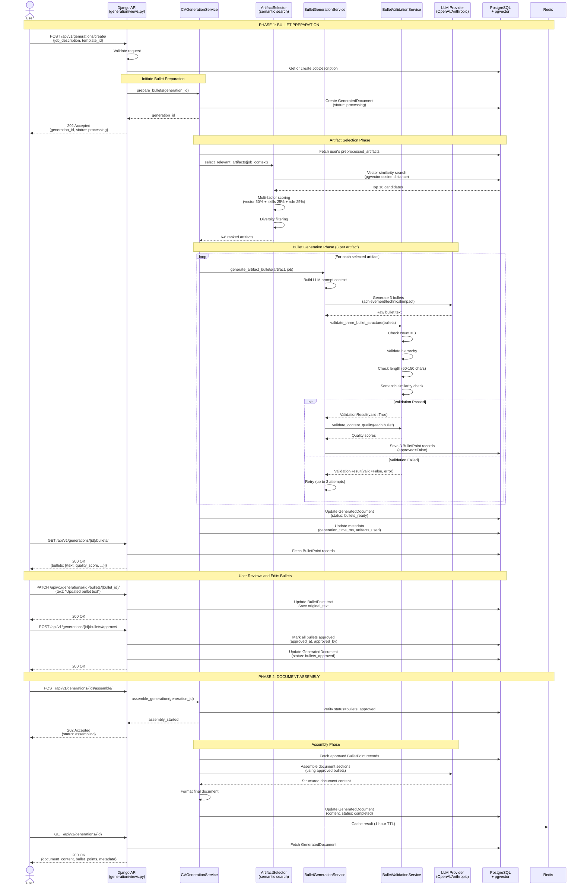

# Tech Spec — Generation System

**Version:** v2.5.0
**File:** docs/specs/spec-cv-generation.md
**Status:** Current
**PRD:** `prd.md`
**Contract Versions:** Generation API v2.2 • Bullet Point Schema v1.0 • Artifact Selection v1.0
**Git Tags:** `spec-generation-v2.0.0`, `spec-generation-v2.1.0`, `spec-generation-v2.2.0`, `spec-generation-v2.3.0`, `spec-generation-v2.4.0`, `spec-generation-v2.5.0`

## Table of Contents

- [Overview & Goals](#overview--goals)
- [Architecture (Detailed)](#architecture-detailed)
  - [Topology (frameworks)](#topology-frameworks)
  - [Component Inventory](#component-inventory)
  - [End-to-End Generation Flow](#end-to-end-generation-flow)
- [Interfaces & Data Contracts](#interfaces--data-contracts)
  - [HTTP API Endpoints](#http-api-endpoints)
  - [Service Interfaces](#service-interfaces)
  - [Data Schemas](#data-schemas)
- [Data & Storage](#data--storage)
- [Reliability & SLIs/SLOs](#reliability--slisslos)
- [Security & Privacy](#security--privacy)
- [Rollout & Ops Impact](#rollout--ops-impact)
- [Risks & Rollback](#risks--rollback)
- [Open Questions](#open-questions)

## Overview & Goals

Design and implement a document generation system that produces exactly 3 tailored bullet points per selected artifact, optimized for target job roles. Target ≤30s end-to-end generation time, ≥8/10 user quality ratings, and ATS-optimized output through structured artifact processing, intelligent bullet point generation, and role-based optimization.

**Key Objectives:**
- Generate exactly 3 structured bullet points per artifact (achievement, technical, impact)
- Intelligent artifact selection using semantic similarity (6-8 most relevant)
- Multi-source artifact preprocessing (GitHub, PDF, web, media)
- ATS-optimized output with keyword matching and quality validation
- End-to-end generation ≤30s with ≥95% success rate

Links to latest PRD: `docs/prds/prd.md`

## Architecture (Detailed)

### Topology (frameworks)

```
┌─────────────────────────────────────────────────────────────────────────┐
│                    Artifact Upload & Preprocessing                     │
│  ┌─────────────────┬─────────────────┬─────────────────┬─────────────┐  │
│  │   Multi-Source  │   Content       │   LLM-Based     │   Storage   │  │
│  │   Ingestion     │   Extraction    │   Description   │   Manager   │  │
│  │  (LangChain)    │  (PyPDF/GitHub) │   Generation    │  (pgvector) │  │
│  └─────────────────┼─────────────────┼─────────────────┼─────────────┘  │
└──────────────────┬─┼─────────────────┼─────────────────┼─────────────────┘
                   │ │                 │                 │
       ┌───────────▼─▼─────────────────▼─────────────────▼───────────┐
       │                Raw Data Source Processing                   │
       │  ┌─────────────┬─────────────┬─────────────────────────────┐ │
       │  │   GitHub    │    PDF      │      Video/Media            │ │
       │  │  Analyzer   │  Extractor  │      Processor              │ │
       │  └─────────────┴─────────────┴─────────────────────────────┘ │
       └─────────────────────┬───────────────────────────────────────┘
                             │ Processed Content
       ┌─────────────────────▼───────────────────────────────────────┐
       │              Preprocessed Artifact Storage                  │
       │  ┌──────────────┬──────────────┬────────────────────────┐   │
       │  │  Unified     │   Extracted  │    Job Relevance       │   │
       │  │ Description  │   Metadata   │    Embeddings          │   │
       │  │  (LLM-gen)   │ (Tech/Achiev)│    (pgvector)          │   │
       │  └──────────────┴──────────────┴────────────────────────┘   │
       └─────────────────────┬───────────────────────────────────────┘
                             │ Retrieval for CV Generation
┌─────────────────────────────▼───────────────────────────────────────────┐
│                    Document Generation Orchestrator                    │
│  ┌─────────────────┬─────────────────┬─────────────────┬─────────────┐  │
│  │   Artifact      │   Bullet Point  │   Role          │   Output    │  │
│  │   Selector      │   Generator     │   Optimizer     │  Formatter  │  │
│  │ (Semantic)      │ (3 per artifact)│  (ATS-optimized)│  (Template) │  │
│  └─────────────────┼─────────────────┼─────────────────┼─────────────┘  │
└──────────────────┬─┼─────────────────┼─────────────────┼─────────────────┘
                   │ │                 │                 │
┌──────────────────▼─▼─────────────────▼─────────────────▼─────────────────┐
│                      Core Generation Engine                            │
│  ┌─────────────────┬─────────────────┬─────────────────┬─────────────┐  │
│  │   Job Context   │  Multi-Source   │   Bullet Point  │   Quality   │  │
│  │   Analyzer      │   Artifact      │   Builder       │  Validator  │  │
│  │ (Requirements)  │   Processor     │ (Struct+Metrics)│ (Multi-crit)│  │
│  └─────────────────┼─────────────────┼─────────────────┼─────────────┘  │
└──────────────────┬─┼─────────────────┼─────────────────┼─────────────────┘
                   │ │                 │                 │
       ┌───────────▼─▼─────────────────▼─────────────────▼───────────┐
       │                    LLM Processing Layer                     │
       │  ┌─────────────┬─────────────┬─────────────────────────────┐ │
       │  │   Prompt    │  Response   │      Template Engine        │ │
       │  │   Engine    │  Parser     │      (Jinja2 + CV)         │ │
       │  │  (Versioned)│  (Pydantic) │   (Multi-format output)     │ │
       │  └─────────────┴─────────────┴─────────────────────────────┘ │
       └─────────────────────┬───────────────────────────────────────┘
                             │ HTTP API Calls
       ┌─────────────────────▼───────────────────────────────────────┐
       │                External LLM APIs                           │
       │  ┌──────────────┬──────────────┬────────────────────────┐   │
       │  │   OpenAI     │  Anthropic   │     Azure OpenAI       │   │
       │  │   GPT-4      │   Claude     │      (Backup)          │   │
       │  └──────────────┼──────────────┼────────────────────────┘   │
       └─────────────────┼──────────────┼────────────────────────────┘
                         │              │
┌────────────────────────▼──────────────▼────────────────────────────────┐
│                 Document Output System                                │
│  ┌─────────────┬─────────────┬─────────────┬─────────────────────────┐ │
│  │  Section    │  ATS        │ PDF/DOCX    │     Version             │ │
│  │  Builder    │ Optimizer   │ Generator   │     Manager             │ │
│  │             │  (Keywords) │ (ReportLab/ │                         │ │
│  │             │             │  python-docx)│                         │ │
│  └─────────────┴─────────────┴─────────────┴─────────────────────────┘ │
└───────────────────────────────────────────────────────────────────────┘
```

### Component Inventory

| Component | Framework/Runtime | Purpose | Interfaces (in/out) | Depends On | Scale/HA | Owner |
|-----------|------------------|---------|-------------------|------------|----------|-------|
| **PREPROCESSING PIPELINE** |
| Multi-Source Ingestion | Django + Celery + uv | Handle artifact uploads with multiple data sources | In: Raw artifact files/URLs; Out: Queued processing tasks | File storage, task queue | Async processing | Backend |
| Content Extraction Manager | Python + LangChain + Celery + uv | Orchestrate content extraction from all sources | In: Processing tasks; Out: Extracted content | All extractors | Background tasks | Backend |
| LLM Description Generator | LLM + Template Engine + uv | Generate unified descriptions from multi-source content | In: Extracted content; Out: Unified description + metadata | LLM providers | Rate-limited by API | Backend |
| Artifact Preprocessor | Python + pgvector + uv | Store processed artifacts with embeddings | In: Generated descriptions; Out: Stored preprocessed artifacts | Database, embedding service | I/O intensive | Backend |
| GitHub Analyzer | Python + GitHub API + uv | Extract code metrics, commits, and project info | In: GitHub repositories; Out: Code analysis and metrics | GitHub API, Git analysis tools | API rate-limited | Backend |
| PDF Extractor | Python + PyPDF2/pdfplumber + uv | Extract text and structure from PDF documents | In: PDF files; Out: Structured text and metadata | PDF parsing libraries | CPU-intensive | Backend |
| Video/Media Processor | Python + FFmpeg + uv | Extract metadata and transcripts from media files | In: Video/audio files; Out: Metadata and transcriptions | FFmpeg, speech-to-text APIs | Memory-intensive | Backend |
| **DOCUMENT GENERATION PIPELINE** |
| Generation Orchestrator | Django + DRF + uv | Coordinate document generation using preprocessed artifacts | In: Job + Preprocessed Artifacts; Out: Generated Documents | Preprocessed storage | Load balanced, stateless | Backend |
| Artifact Selector | Python + Vector Search + uv | Select relevant artifacts for job (6-8 using semantic similarity) | In: Job requirements + All artifacts; Out: Ranked artifact list | Vector DB, embeddings | Memory-intensive | Backend |
| Bullet Point Generator | LLM + Template Engine + uv | Generate exactly 3 bullets per artifact (achievement/technical/impact) | In: Artifact + Job context; Out: 3 formatted bullets | LLM providers, templates | Rate-limited by API | Backend |
| Role Optimizer | LLM + Job Analysis + uv | Optimize content for target role with ATS keywords | In: Raw bullets + Job requirements; Out: Role-optimized bullets | LLM providers, job taxonomy | CPU-intensive | Backend |
| Output Formatter | Python + Jinja2 + uv | Format CV sections and structure for PDF/DOCX | In: Generated content; Out: Structured CV | Template engine | Stateless, fast | Backend |
| Job Context Analyzer | LLM + NLP + uv | Extract job requirements and context | In: Job description; Out: Structured requirements | LLM providers | Cacheable results | Backend |
| Multi-Source Artifact Processor | Python + Data Processing + uv | Normalize and enrich multi-source artifact data | In: Raw artifacts with multiple data sources; Out: Unified artifact representation | Database, file storage | I/O intensive | Backend |
| Bullet Point Builder | Template Engine + Validation + uv | Construct and validate bullet points | In: Content + Structure; Out: Validated bullets | Templates, validation rules | Stateless | Backend |
| Quality Validator | Python + Rules Engine + uv | Validate bullet point quality (multi-criteria scoring) | In: Generated bullets; Out: Quality scores | Quality metrics | CPU-intensive | Backend |

## Interfaces & Data Contracts

### End-to-End Generation Flow

The generation workflow follows a **two-phase pattern** with a user review pause point:

**Phase 1: Bullet Preparation** - Generate bullets for user review
**Phase 2: Document Assembly** - Assemble final documents from approved bullets



### HTTP API Endpoints

The CV generation system exposes the following REST API endpoints:

**Generation Management:**
- `POST /api/v1/generations/create/` - Create new generation job (initiates bullet preparation phase)
- `GET /api/v1/generations/` - List user's generations (paginated, filterable by status)
- `GET /api/v1/generations/{id}/` - Get full generation details with content and bullets
- `POST /api/v1/generations/{id}/assemble/` - Trigger document assembly from approved bullets
- `DELETE /api/v1/generations/{id}/` - Delete generation and associated bullets

**Bullet Operations:**
- `GET /api/v1/generations/{id}/bullets/` - Retrieve all bullets for a generation
- `PATCH /api/v1/generations/{id}/bullets/{bullet_id}/` - Edit individual bullet text
- `POST /api/v1/generations/{id}/bullets/approve/` - Approve bullets and proceed to assembly
- `POST /api/v1/generations/{id}/bullets/regenerate/` - Regenerate bullets with refinement prompt
- `POST /api/v1/generations/bullets/validate/` - Validate bullet structure and quality without saving

**Configuration & Analytics:**
- `GET /api/v1/generations/templates/` - List available CV/cover letter templates
- `GET /api/v1/generations/analytics/` - Get user generation analytics and statistics

**Quality & Feedback:**
- `POST /api/v1/generations/{id}/rate/` - Rate completed generation (1-10 scale)
- `POST /api/v1/generations/{id}/feedback/` - Submit detailed feedback on generation quality

### Data Contracts

#### CV Generation Request/Response

```python
# CV Generation Request
@dataclass
class CVGenerationRequest:
    user_id: int
    job_description: str
    selected_artifact_ids: List[int]  # Optional; auto-select if empty
    template_id: Optional[str] = "default"
    optimization_settings: Dict[str, Any] = field(default_factory=dict)

# CV Generation Response
@dataclass
class CVGenerationResponse:
    cv_id: str
    sections: Dict[str, Any]
    artifact_bullets: List[ArtifactBulletSection]  # Each with exactly 3 bullets
    generation_metadata: GenerationMetadata
    quality_score: float
    ats_compatibility_score: float

# Preprocessed Artifact (stored in database with pgvector embedding)
@dataclass
class PreprocessedArtifact:
    id: int
    title: str
    unified_description: str  # LLM-generated from all sources
    extracted_technologies: List[str]  # LLM-refined and normalized
    extracted_achievements: List[str]
    quantified_metrics: Dict[str, Any]
    embedding_vector: List[float]  # For dynamic job similarity calculation
    source_summary: SourceSummary
    processing_confidence: float
    created_at: datetime
    last_processed: datetime

# Source Summary (condensed from original sources)
@dataclass
class SourceSummary:
    github_repos: List[GitHubSummary]
    documents: List[DocumentSummary]
    media_files: List[MediaSummary]
    external_links: List[str]
    total_sources: int

# Artifact Bullet Section (uses preprocessed data)
@dataclass
class ArtifactBulletSection:
    artifact_id: int
    artifact_title: str
    bullet_points: List[BulletPoint]  # Exactly 3 bullets
    relevance_score: float
    source_summary: SourceSummary

# Individual Bullet Point (structured hierarchy)
@dataclass
class BulletPoint:
    text: str  # 60-150 characters
    position: int  # 1, 2, or 3
    type: str  # "achievement", "technical", "impact" (structured hierarchy)
    metrics: Optional[Dict[str, Any]]  # quantified metrics if available
    keywords: List[str]  # job-relevant keywords included
    confidence_score: float  # 0-1
    quality_score: float  # 0-1 (multi-criteria validation)
    evidence_reference: Optional[str]
```

### Service Interfaces

Services are organized by architectural layer following the llm_services pattern:

**Orchestration Layer** - High-level coordinators that manage workflows and aggregate data

```python
class GenerationService:
    """Orchestrates CV generation with two-phase workflow and user review pause point."""

    async def prepare_bullets(
        self,
        generation_id: str,
        artifact_ids: Optional[List[int]] = None,  # Manual selection (ft-007)
        progress_callback: Optional[Callable[[int], None]] = None
    ) -> BulletPreparationResult:
        """Phase 1: Generate bullets for user review."""
        pass

    async def assemble_cv(
        self,
        generation_id: str,
        progress_callback: Optional[Callable[[int], None]] = None
    ) -> GenerationResult:
        """Phase 2: Assemble CV from approved bullets."""
        pass

@dataclass
class BulletPreparationResult:
    """Result container for bullet preparation phase."""
    total_bullets_generated: int
    artifacts_processed: int
    bullets_by_artifact: Optional[Dict[int, int]] = None
    generation_time_ms: Optional[int] = None

class GenerationStatusService:
    """
    Unified status endpoint aggregating GeneratedDocument, BulletGenerationJob, and BulletPoint data.
    Matches artifact enrichment-status pattern for consistency.
    """

    def get_generation_status(self, generation_id: str) -> GenerationStatusResponse:
        """Get unified status for generation and all related jobs. Used for frontend polling."""
        pass

@dataclass
class GenerationStatusResponse:
    generation_id: str
    status: str
    progress_percentage: int
    error_message: Optional[str]
    created_at: datetime
    completed_at: Optional[datetime]
    current_phase: str  # 'bullet_generation' | 'bullet_review' | 'assembly' | 'completed'
    phase_details: Dict[str, Any]
    bullet_generation_jobs: List[Dict[str, Any]]
    processing_metrics: Dict[str, Any]
    quality_metrics: Dict[str, Any]
```

**Domain Services** - Specialized services handling specific business logic

```python
class BulletGenerationService:
    """
    Generate 3 structured bullet points per artifact.
    Follows llm_services architecture pattern.
    """

    async def generate_artifact_bullets(
        self,
        preprocessed_artifact: PreprocessedArtifact,
        job_context: JobContext,
        bullet_count: int = 3
    ) -> List[BulletPoint]:
        """Generate exactly 3 bullets with hierarchy (achievement/technical/impact)."""
        pass

class BulletValidationService:
    """Multi-criteria bullet point validation service."""

    def validate_three_bullet_structure(self, bullets: List[BulletPoint]) -> ValidationResult:
        """Validate exactly 3 bullets with proper hierarchy (count, type, length, uniqueness)."""
        pass

    def validate_content_quality(self, bullet: BulletPoint) -> float:
        """Score quality (0-1): length 20%, action verb 20%, metrics 30%, keywords 20%, generic penalty 10%."""
        pass

class ArtifactSelectorService:
    """Intelligent artifact selection using vector similarity and pgvector."""

    async def select_relevant_artifacts(
        self,
        user_id: int,
        job_context: JobContext,
        max_artifacts: int = 8
    ) -> List[RankedArtifact]:
        """
        Select 6-8 most relevant artifacts.
        Multi-factor scoring: vector similarity 50%, skill matching 25%, role level 25%.
        """
        pass

@dataclass
class RankedArtifact:
    artifact: PreprocessedArtifact
    relevance_score: float
    matching_skills: List[str]
    role_alignment: str  # "high", "medium", "low"
    bullet_potential: float
```

## Data & Storage

**Primary Models:**

| Model | Purpose | Key Fields | Relationships |
|-------|---------|-----------|---------------|
| `GeneratedDocument` | CV generation job with two-phase workflow | status (7 states), content, artifacts_used, quality_score | FK: User, JobDescription; Reverse: BulletPoint |
| `BulletPoint` | Individual bullet with structured hierarchy | text, bullet_type (achievement/technical/impact), quality_score, user_approved | FK: GeneratedDocument, Artifact |
| `PreprocessedArtifact` | Artifact storage with pgvector embeddings | unified_description, embedding_vector (1536d), extracted_technologies | FK: User |
| `BulletGenerationJob` | Per-artifact bullet generation tracking | status, bullets_generated, quality_metrics | FK: GeneratedDocument, Artifact |

**Status Workflow:** pending → processing → bullets_ready → bullets_approved → assembling → completed/failed

**Storage Backend:**
- Database: PostgreSQL 15+ with pgvector extension
- Vector Search: pgvector for semantic artifact selection (cosine similarity)
- Caching: Redis for generation results (1 hour TTL)
- Indexes: User queries, status filtering, vector similarity search

**Authoritative Schema:** See `docs/specs/spec-database-schema.md` for complete field definitions, constraints, and migrations.

## Reliability & SLIs/SLOs

### CV Generation Service Level Objectives

- **Generation Success Rate:** ≥95% for valid artifact + job combinations
- **Response Time:** P95 ≤30s for CV generation with ≤8 artifacts
- **Bullet Point Quality:** ≥8/10 average user rating for generated bullets
- **Bullet Count Accuracy:** ≥95% of generations produce exactly 3 bullets per artifact
- **ATS Compatibility:** ≥90% of generated CVs pass ATS parsing tests
- **Availability:** ≥99.5% uptime during business hours
- **Artifact Selection Accuracy:** ≥80% of selected artifacts rated relevant by users
- **Content Quality:** Generic content rate ≤5%, redundancy rate ≤10%

### Quality Assurance Framework

See detailed CVQualityValidator implementation in spec-20250927-cv-generation.md (lines 654-753)

## Security & Privacy

### Input Validation
- Job description: max 50K chars, prompt injection detection
- Artifact selection: max 20 artifacts per request
- PII detection in job descriptions

### Output Sanitization
- Remove SSN, credit card patterns from generated content
- Sanitize emails (unless whitelisted)

**Implementation:** See `backend/generation/validators.py` and `docs/security/backend-security.md`

## Rollout & Ops Impact

### Monitoring
- **Performance:** generation_duration, quality_score, user_rating
- **Reliability:** generation_total (by status), bullet_count_accuracy
- **Quality:** generic_content_rate, redundancy_rate

**Configuration:** See `backend/generation/monitoring.py` for Prometheus metrics

### Rollout Strategy

**Phase 1**: Internal testing with 10 invited users (3-bullet generation, basic validation)
**Phase 2**: Beta release with 10% traffic (full quality validation, A/B testing)
**Phase 3**: Gradual rollout to 50% traffic (monitoring quality metrics)
**Phase 4**: Full release with 100% traffic (performance optimization)

## Risks & Rollback

### Primary Risks

1. **LLM generates != 3 bullets** → Mitigation: Strict validation, auto-regeneration (up to 3 attempts)
2. **Generic/repetitive bullets** → Mitigation: Semantic similarity detection, quality scoring, user feedback
3. **Bullet length violations** → Mitigation: Length validation in prompts, automatic truncation/expansion with approval
4. **Poor ATS keyword optimization** → Mitigation: Job-specific keyword injection, ATS testing framework

### Rollback Strategy
- **Trigger:** 10% failure rate or <60% quality score for 30 minutes
- **Fallback:** Template-based generation without LLM
- **Monitoring:** Success rate, quality scores, P95 latency, bullet accuracy

## Open Questions

1. **Fine-tuning**: Should we fine-tune models on domain-specific CV data vs. using general-purpose models?
2. **Bullet hierarchy enforcement**: Hard constraint vs. soft suggestion for achievement/technical/impact structure?
3. **User override**: Allow users to regenerate specific bullets vs. entire artifact bullet set?
4. **A/B testing**: Test 3-bullet vs. variable bullet count (2-5) for user preference?
