# Tech Spec — Database Schema

**Version:** v1.2.1
**File:** docs/specs/spec-database-schema.md
**Status:** Current
**Parent Spec:** `spec-system.md` (v1.2.0)
**Git Tag:** `spec-database-schema-v1.2.1`

## Overview

This document provides the **complete database schema** for CV Tailor, including all table definitions, relationships, field-level details, and constraints. This spec was extracted from `spec-system.md` to maintain a focused system-level architecture document while preserving detailed schema documentation.

**Parent Architecture:** See `spec-system.md` for:
- High-level system architecture and component topology
- Service layer patterns and API contracts
- Deployment infrastructure and reliability patterns

**Technology Stack:**
- **Database:** PostgreSQL 15+ (AWS RDS Multi-AZ in production)
- **Extensions:** pgvector for vector similarity search (OpenAI embeddings)
- **ORM:** Django 4.2+ with Django REST Framework

---

## Source of Truth

**Django Models:** Authoritative schema definitions reside in Django model files:
- `backend/accounts/models.py` - User authentication and profiles
- `backend/artifacts/models.py` - Artifact and evidence management
- `backend/generation/models.py` - CV generation and bullet points
- `backend/export/models.py` - Document export pipeline
- `backend/llm_services/models.py` - LLM reliability and performance tracking

**Migrations:** Complete DDL including indexes, constraints, and data migrations in:
- `backend/*/migrations/` - Django migration files (source of truth for DDL)

**This document** provides a consolidated view of the complete schema for quick reference and architectural understanding. For implementation details, refer to Django models and migrations.

---

## Architecture

The database architecture is documented through three complementary views: the **Entity Relationship Diagram** shows table relationships and foreign keys, **Architectural Patterns** describe key design decisions, and **Table Groups** organize tables by business domain and data flow pipelines.

### Entity Relationship Diagram

**Authoritative Source:** See `backend/*/models.py` for complete field definitions, constraints, and indexes. This ERD shows table relationships and key fields only.

The following ERD shows the **database schema relationships** with primary and foreign keys as of v1.1.0:

```mermaid
erDiagram
    %% Core User & Authentication
    accounts_user ||--o{ artifacts_artifact : "owns"
    accounts_user ||--o{ generation_generateddocument : "creates"
    accounts_user ||--o{ generation_bullet_generation_job : "requests"
    accounts_user ||--o{ token_blacklist_outstandingtoken : "has_tokens"
    accounts_user ||--o{ socialaccount_socialaccount : "links_to"
    accounts_user ||--o{ enhanced_evidence : "has_processed"
    accounts_user ||--o{ export_exportjob : "requests_exports"
    accounts_user ||--o{ artifacts_uploadedfile : "uploads"
    accounts_user ||--o{ model_performance_metrics : "tracks"

    %% Artifact Processing Pipeline
    artifacts_artifact ||--o{ evidence : "has_evidence"
    artifacts_artifact ||--o{ generation_bullet_point : "described_by"
    artifacts_artifact ||--o{ artifacts_artifactprocessingjob : "processing_jobs"
    artifacts_artifact ||--o{ generation_bullet_generation_job : "bullet_jobs"

    evidence ||--o| enhanced_evidence : "enhanced_as"
    evidence ||--o| github_repository_analysis : "analyzed_as"

    artifacts_artifactprocessingjob ||--o{ extracted_content : "extracts"
    extracted_content ||--o| github_repository_analysis : "agent_analysis"

    %% Generation Pipeline
    generation_generateddocument ||--o{ generation_bullet_point : "contains"
    generation_generateddocument ||--o{ generation_bullet_generation_job : "spawns"
    generation_generateddocument }o--|| generation_jobdescription : "references"
    generation_generateddocument ||--o{ generation_generationfeedback : "receives_feedback"
    generation_generateddocument ||--o{ export_exportjob : "exported_as"

    generation_bullet_generation_job ||--o{ generation_bullet_point : "generates"

    %% Export Pipeline
    export_exportjob }o--|| export_exporttemplate : "uses_template"
    export_exportjob ||--o{ export_exportanalytics : "tracked_by"

    %% Token Management
    token_blacklist_outstandingtoken ||--o{ token_blacklist_blacklistedtoken : "blacklisted_as"

    accounts_user {
        bigint id PK
        varchar email UK
        varchar username UK
    }

    artifacts_artifact {
        int id PK
        bigint user_id FK
        varchar artifact_type
    }

    enhanced_evidence {
        uuid id PK
        bigint user_id FK
        int evidence_id FK
    }

    extracted_content {
        uuid id PK
        uuid preprocessing_job_id FK
    }

    artifacts_artifactprocessingjob {
        uuid id PK
        int artifact_id FK
    }

    artifacts_uploadedfile {
        uuid id PK
        bigint user_id FK
    }

    generation_bullet_point {
        int id PK
        int artifact_id FK
        uuid cv_generation_id FK
    }

    generation_generateddocument {
        uuid id PK
        bigint user_id FK
    }

    generation_jobdescription {
        int id PK
        varchar content_hash UK
    }

    token_blacklist_outstandingtoken {
        int id PK
        bigint user_id FK
        varchar jti UK
    }

    token_blacklist_blacklistedtoken {
        int id PK
        int token_id FK
    }

    evidence {
        int id PK
        int artifact_id FK
    }

    generation_bullet_generation_job {
        uuid id PK
        int artifact_id FK
        uuid cv_generation_id FK
        bigint user_id FK
    }

    generation_generationfeedback {
        int id PK
        uuid generation_id FK
    }

    generation_cvtemplate {
        int id PK
    }

    generation_skillstaxonomy {
        int id PK
        varchar skill_name UK
    }

    model_performance_metrics {
        uuid id PK
        bigint user_id FK
    }

    circuit_breaker_states {
        varchar model_name PK
    }

    model_cost_tracking {
        bigint user_id FK
        date date
        varchar model_name
    }

    export_exporttemplate {
        int id PK
    }

    export_exportjob {
        uuid id PK
        bigint user_id FK
        uuid generated_document_id FK
        int template_id FK
    }

    export_exportanalytics {
        int id PK
        uuid export_job_id FK
    }

    socialaccount_socialaccount {
        int id PK
        bigint user_id FK
    }

    github_repository_analysis {
        uuid id PK
        int evidence_id FK
        uuid extracted_content_id FK
    }
```



### Architectural Patterns

- **Artifact Ranking:** Keyword-based ranking using job description matching (embeddings removed in ft-007)
- **JWT Lifecycle Management:** Token blacklist pattern for secure logout and token rotation
- **Evidence Processing Pipeline:** Per-source enhancement via LLM, unified at artifact level
- **Evidence Types:** Two types supported: `github` (repositories with agent-based analysis) and `document` (PDF uploads)
- **GitHub Analysis:** Four-phase agent traversal (reconnaissance, file selection, hybrid analysis, refinement) with confidence scoring
- **LLM Reliability:** Circuit breaker pattern with performance metrics and cost tracking
- **Export Workflow:** Template-based document generation with analytics tracking
- **Audit Trail:** Comprehensive timestamps and confidence scores throughout processing
- **OAuth Support:** Social authentication via django-allauth integration

### Table Groups

The database is organized into five logical groups based on business domain and data flow. These groups help developers understand table relationships and identify which tables are involved in specific features.

#### Core User & Authentication
accounts_user, token_blacklist_*, socialaccount_socialaccount

#### Artifact Processing Pipeline
```
artifacts_artifact → evidence → enhanced_evidence
evidence → github_repository_analysis (GitHub analysis)
artifacts_artifactprocessingjob → extracted_content
artifacts_uploadedfile (temporary file storage)
```

#### Generation Pipeline
```
generation_jobdescription (parsed job data)
generation_generateddocument → generation_bullet_generation_job → generation_bullet_point
generation_cvtemplate, generation_skillstaxonomy (supporting data)
generation_generationfeedback (user feedback)
```

#### Export Pipeline
```
export_exporttemplate → export_exportjob → export_exportanalytics
```

#### LLM Reliability & Monitoring
model_performance_metrics, circuit_breaker_states, model_cost_tracking, github_repository_analysis

---

## References

### Related Specs
- **spec-system.md v1.2.0** - Parent system architecture with high-level component topology
- **spec-artifact-upload-enrichment-flow.md** - Artifact processing and enrichment pipeline details
- **spec-cv-generation.md** - CV generation pipeline and bullet point generation

### Related Features
- **ft-007** - Manual artifact selection with keyword-based ranking (replaced embedding infrastructure)
- **ft-013** - GitHub agent traversal with four-phase analysis (reconnaissance, file selection, hybrid analysis, refinement)
- **ft-006** - Generation service layer modernization
- **ft-010** - Pure service layer pattern (no DB writes in services)

### Django Models (Source of Truth)
- **backend/accounts/models.py** - User authentication and profile schema
- **backend/artifacts/models.py** - Artifact, evidence, and file upload schema
- **backend/generation/models.py** - CV generation, bullet points, and job description schema
- **backend/export/models.py** - Export templates, jobs, and analytics schema
- **backend/llm_services/models.py** - LLM reliability, GitHub analysis, and performance tracking schema

### Key Migrations
- **llm_services/migrations/0012_remove_embedding_infrastructure.py** - Removed artifact_chunks and job_embeddings tables (ft-007)
- **llm_services/migrations/0010_github_repository_analysis.py** - Added github_repository_analysis table (ft-013)
