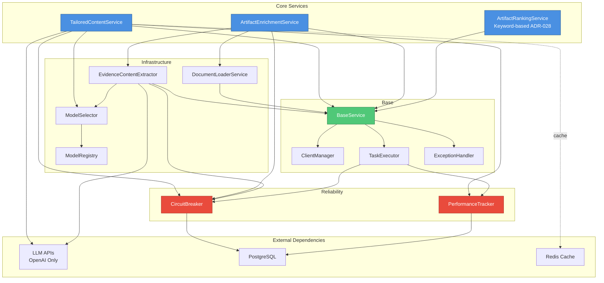

# Tech Spec — LLM

**Version:** v4.3.1
**File:** docs/specs/spec-llm.md
**Status:** Current
**PRD:** `prd.md` v1.5.0
**Contract Versions:** Prompt Set v2.0 • Model API v3.0 • Evaluation v1.0 • LLM Pipeline v3.0 • Model Registry v3.1 • Agent Prompts v1.0 • PDF Processing v1.0 • Source Attribution v1.0 • Verification Service v1.0 • GPT-5 Config v2.0 • Evidence Review v1.0
**Git Tag:** `spec-llm-v4.3.1`

## Overview & Goals

Design and implement a robust LLM integration system for job description parsing, artifact-to-skill matching, and CV/cover letter content generation. Target ≥95% generation success rate, ≤30s end-to-end generation time, ≥8/10 user quality ratings, and **≤5% hallucination rate** through prompt engineering, model selection, source attribution, verification services, and evaluation frameworks.

**Key Objectives:**
- OpenAI-based LLM integration with GPT-5 family models and automatic failover
- **Anti-hallucination architecture: Source attribution, verification layer, confidence scoring**
- **Content quality: ≤5% hallucination rate, ≥90% verification pass rate, ≥80% user acceptance**
- Prompt management with versioning, A/B testing, and explicit anti-inference rules
- Keyword-based artifact ranking with manual user selection (ADR-028)
- Intelligent content extraction from multi-format artifacts (LangChain) with source traceability
- Service layer architecture with clear separation of concerns
- Post-generation verification service for fact-checking against source documents
- Comprehensive evaluation framework with golden datasets and hallucination detection

Links to latest PRD: `docs/prds/prd.md` v1.4.0

## Architecture (Detailed)

### Topology (frameworks)

```
┌─────────────────────────────────────────────────────────────────────────┐
│                    LLM Orchestration Layer                              │
│  ┌─────────────────┬─────────────────┬─────────────────┬─────────────┐  │
│  │   Prompt        │   Model         │   Response      │   Quality   │  │
│  │   Manager       │   Router        │   Parser        │  Validator  │  │
│  │   (Jinja2)      │   (Failover)    │   (Pydantic)    │ (Rules)     │  │
│  └─────────────────┼─────────────────┼─────────────────┼─────────────┘  │
└──────────────────┬─┼─────────────────┼─────────────────┼─────────────────┘
                   │ │                 │                 │
┌──────────────────▼─▼─────────────────▼─────────────────▼─────────────────┐
│                      Service Layer (Django)                             │
│  ┌─────────────────┬─────────────────┬─────────────────┬─────────────┐  │
│  │   Tailored      │   Artifact      │   Evidence      │   Document  │  │
│  │   Content       │   Ranking       │   Content       │   Loader    │  │
│  │   Service       │   Service       │   Extractor     │ (LangChain) │  │
│  └─────────────────┼─────────────────┼─────────────────┼─────────────┘  │
└──────────────────┬─┼─────────────────┼─────────────────┼─────────────────┘
                   │ │                 │                 │
       ┌───────────▼─▼─────────────────▼─────────────────▼───────────┐
       │                    Provider Abstraction                     │
       │  ┌─────────────────────────────────────────────────────────┐ │
       │  │   OpenAI Client (Unified API Access)                    │ │
       │  │   - GPT-5 Family (gpt-5, gpt-5-mini, gpt-5-nano)       │ │
       │  └─────────────────────────────────────────────────────────┘ │
       └─────────────────────┬───────────────────────────────────────┘
                             │ HTTP API Calls
       ┌─────────────────────▼───────────────────────────────────────┐
       │                External LLM APIs                           │
       │  ┌─────────────────────────────────────────────────────┐   │
       │  │   OpenAI API (Primary & Only Provider)              │   │
       │  │   - GPT-5 (128K context, balanced)                  │   │
       │  │   - GPT-5-mini (128K context, cost-optimized)       │   │
       │  │   - GPT-5-nano (128K context, ultra-cheap)          │   │
       │  │   - text-embedding-3-small (1536 dims)              │   │
       │  └─────────────────────────────────────────────────────┘   │
       └─────────────────────────────────────────────────────────────┘
                             │
┌────────────────────────▼──────────────▼────────────────────────────────┐
│                    Storage & Evaluation                                │
│  ┌─────────────┬─────────────┬─────────────────────────┐              │
│  │  PostgreSQL │  Redis      │     MLflow              │              │
│  │  (Prompts)  │  (Cache)    │  (Eval/A/B Testing)     │              │
│  └─────────────┴─────────────┴─────────────────────────┘              │
└───────────────────────────────────────────────────────────────────────┘
```

### Component Inventory

| Component | Framework/Runtime | Purpose | Interfaces (in/out) | Depends On | Scale/HA | Owner |
|-----------|------------------|---------|-------------------|------------|----------|-------|
| Prompt Manager | Python + Jinja2 + uv | Template management, version control | In: Task type + data; Out: Formatted prompts | Template storage, DB | Stateless, cacheable | ML/Backend |
| Model Router | Python + asyncio + uv | Load balancing, failover between providers | In: Requests; Out: Routed calls | Provider clients | Auto-scale, circuit breaker | ML/Backend |
| Response Parser | Python + Pydantic + uv | Structure and validate LLM outputs | In: Raw responses; Out: Typed objects | Pydantic models | Stateless, fast | ML/Backend |
| Quality Validator | Python + Rule Engine + uv | Content quality checks, safety filters | In: Generated content; Out: Quality scores | Evaluation metrics | CPU-intensive scaling | ML/Backend |
| TailoredContentService | Django + Python + uv | Generate job-tailored CVs, cover letters | In: Job + artifacts; Out: Tailored content | LLM providers, templates | Rate-limited by API | ML/Backend |
| ArtifactRankingService | Django + Python + uv | Rank artifacts by keyword matching (ADR-028) | In: Artifacts + job; Out: Ranked artifacts | None (keyword-only) | Lightweight | ML/Backend |
| DocumentLoaderService | LangChain + Python + uv | Multi-format content extraction | In: Files/URLs; Out: Structured content | LangChain, PyPDF2 | Queue-based scaling | ML/Backend |
| PDFDocumentClassifier | Python + PyPDF2 + LLM + uv | Classify PDF documents into types | In: PDF metadata; Out: Document category | PyPDF2, LLM APIs | Stateless, cacheable | ML/Backend |
| Provider Clients | HTTP + Retry Logic + uv | Abstract API calls to LLM services | In: Prompts; Out: Completions | External APIs | Connection pooling | ML/Backend |
| Evaluation System | Python + MLflow + uv | Track metrics, A/B tests, golden sets | In: Outputs + labels; Out: Quality metrics | MLflow, golden datasets | Batch processing | ML/Backend |

## Service Layer Architecture

### Service Responsibilities

The `llm_services` app follows a layered architecture with clear separation of concerns:

| Service | Responsibility | Key Methods | Layer |
|---------|---------------|-------------|-------|
| **TailoredContentService** | Generate job-tailored application documents (CVs, cover letters) | `parse_job_description()`, `generate_cv_content()`, `assemble_final_document()` | Core |
| **ArtifactEnrichmentService** | Multi-source artifact preprocessing and unification; **[NEW v4.3]** two-phase enrichment workflow (Phase 1: per-source extraction, Phase 2: user-guided reunification) | `preprocess_multi_source_artifact()`, **`extract_per_source_only()`**, `extract_from_all_sources()`, `unify_content_with_llm()`, **`reunify_from_accepted_evidence()`** | Core |
| **BulletVerificationService** | **[NEW v4.0]** Verify generated content against source documents to prevent hallucinations | `verify_bullet_set()`, `verify_single_bullet()`, `classify_claim()`, `find_supporting_evidence()` | Core (generation app) |
| **ArtifactRankingService** | Rank artifacts by keyword matching (ADR-028: embeddings removed) | `rank_artifacts_by_relevance()`, `calculate_relevance_score()` | Core |
| **EvidenceContentExtractor** | LLM-based content extraction with source attribution (v4.0: enhanced) | `extract_pdf_content()`, `extract_github_content()`, `normalize_technologies()`, **`extract_with_attribution()`** | Core |
| **DocumentLoaderService** | Extract content from multi-format artifacts | `load_pdf()`, `load_github_repo()`, `load_web_content()` | Infrastructure |
| **PDFDocumentClassifier** | Classify PDF documents into types for adaptive processing | `classify_document()`, `get_processing_strategy()`, `analyze_metadata()` | Infrastructure |
| **ModelSelector** | Intelligent model selection with fallback | `select_model_for_task()`, `get_fallback_model()` | Infrastructure |
| **CircuitBreaker** | Fault tolerance for external API calls | `call()`, `open()`, `close()` | Reliability |

### Service Patterns

```python
# Service structure follows llm_services architecture
llm_services/services/
├── base/                              # Foundation abstractions
│   ├── base_service.py               # Base service class
│   ├── client_manager.py             # API client lifecycle
│   ├── task_executor.py              # Retry logic, timeouts
│   └── exception_handler.py          # Error handling
├── core/                              # Business logic
│   ├── tailored_content_service.py   # Job-tailored content generation
│   ├── artifact_ranking_service.py   # Keyword-based ranking (ADR-028)
│   ├── document_loader_service.py    # Multi-format content extraction
│   ├── artifact_enrichment_service.py # Multi-source preprocessing
│   └── evidence_content_extractor.py # LLM-based content extraction (v4.0: enhanced with source attribution)
├── infrastructure/                    # Supporting components
│   ├── model_registry.py             # Model configurations
│   ├── model_selector.py             # Model selection with fallbacks
│   └── pdf_document_classifier.py    # PDF document type classification
└── reliability/                      # Fault tolerance
    ├── circuit_breaker.py            # Failure detection and recovery
    └── performance_tracker.py        # Metrics, cost tracking

# Note: BulletVerificationService located in generation/services/
# (part of generation app, not llm_services)
```

### Service Dependency Graph

The following diagram illustrates the actual service dependencies and composition within the `llm_services` app:



**Key Observations:**
- All core services inherit from `BaseService` for common functionality
- Circuit breaker and performance tracking integrated at the base layer
- Model selection abstracted through `ModelSelector` → `ModelRegistry`
- Clear separation: base → infrastructure → core → reliability
- **ADR-028 Update**: EmbeddingService removed, ArtifactRankingService simplified to keyword-only

## PDF Document Classification and Adaptive Processing

### Overview

The PDF processing system adapts its extraction strategy based on document type, optimizing token usage and summary quality. Documents are classified into 5 categories, each with tailored processing strategies.

### Document Type Taxonomy

| Category | Page Range | Size Range | Detection Keywords | Use Case |
|----------|-----------|-----------|-------------------|----------|
| **Resume/CV** | 1-5 | 50-500 KB | "experience", "education", "skills" | Professional CV, resume |
| **Certificate** | 1-3 | 50-200 KB | "certificate", "awarded", "completion" | Course completion, certifications |
| **Research Paper** | 5-20 | 200KB-1MB | "abstract", "methodology", "results" | Academic papers, conference papers |
| **Project Report** | 10-50 | 500KB-2MB | "introduction", "implementation", "conclusion" | Capstone reports, project documentation |
| **Academic Thesis** | 50-500 | 1-10MB | "thesis", "dissertation", "chapter" | PhD theses, dissertations |

### Processing Strategies

Each document type has an optimized processing configuration:

| Category | Max Chars | Sampling | Summary Tokens | Map/Reduce |
|----------|-----------|----------|----------------|------------|
| Resume | 50K | full | 1K | No |
| Certificate | 10K | full | 500 | No |
| Research Paper | 100K | section_aware | 1.5K | No |
| Project Report | 150K | adaptive | 2K | No |
| Academic Thesis | 300K | map_reduce | 3K | Yes (hierarchical) |

**Note:** See `backend/llm_services/services/infrastructure/pdf_document_classifier.py` for complete configuration details.

### PDF Document Classifier Service

**Service Interface:**
```python
class PDFDocumentClassifier(BaseLLMService):
    """Classify PDF documents into categories for adaptive processing."""

    # Method signatures (see feature specs for implementation)
    async def classify_document(
        self,
        file_path: str,
        metadata: Optional[Dict[str, Any]] = None
    ) -> Dict[str, Any]:
        """
        Classify PDF into category (resume, certificate, paper, report, thesis).

        Returns: {category: str, confidence: float, processing_strategy: Dict, metadata: Dict}
        """
```

**Classification Strategy:**
- **Rule-based classification**: Page count, file size, keyword matching (5 categories)
- **LLM refinement**: Triggered for confidence < 0.7
- **Keyword categories**: Resume, certificate, research_paper, project_report, academic_thesis

**Processing Heuristics:**
- ≤3 pages + <200KB → Certificate/Resume (confidence: 0.85-0.9)
- 5-20 pages → Research paper (confidence: 0.85)
- 10-50 pages → Project report (confidence: 0.7)
- ≥50 pages → Academic thesis (confidence: 0.9)

### Enhanced EvidenceContentExtractor Integration

**Service Interface:**
```python
class EvidenceContentExtractor(BaseLLMService):
    """Enhanced with adaptive PDF processing based on document classification."""

    async def extract_pdf_content(
        self,
        pdf_chunks: List[Dict[str, Any]],
        user_id: Optional[int] = None,
        source_url: Optional[str] = None
    ) -> ExtractedContent:
        """Extract content with adaptive processing based on document type."""
```

**Adaptive Processing Flow:**
1. **Document Classification**: Classify PDF via PDFDocumentClassifier
2. **Strategy Selection**: Get processing strategy from classification result
3. **Chunk Selection**: Apply sampling strategy (full, section_aware, map_reduce, adaptive)
4. **Text Combination**: Combine chunks with adaptive character limit (strategy['max_chars'])
5. **LLM Extraction**: Extract with category-specific prompt (task_type: `pdf_content_extraction_{category}`)
6. **Response Assembly**: Include document_category and classification_confidence in result

**Return Schema Enhancement:**
```python
ExtractedContent(
    source_type='pdf',
    data={
        'document_category': str,  # NEW: resume, certificate, etc.
        'classification_confidence': float,  # NEW: 0.0-1.0
        # ... existing fields (technologies, achievements, metrics, summary)
    }
)
```

### Performance Impact

**Token Usage by Document Type:**

| Document Type | Current (Fixed) | New (Adaptive) | Change |
|--------------|----------------|----------------|---------|
| Resume (2 pages) | 10,000 tokens | 10,000 tokens | 0% |
| Certificate (1 page) | 10,000 tokens | 5,000 tokens | -50% ✅ |
| Research Paper (15 pages) | 10,000 tokens | 25,000 tokens | +150% |
| Project Report (30 pages) | 10,000 tokens | 40,000 tokens | +300% |
| Academic Thesis (200 pages) | 10,000 tokens | 300,000 tokens | +2900% |

**Cost Optimization:**
- **Small documents** (certificates, resumes): 50% token reduction = 50% cost savings
- **Large documents** (theses): Better extraction quality justifies increased cost
- **Overall**: Net neutral cost with significantly improved quality

## Anti-Hallucination Architecture (v4.0)

### Overview

The anti-hallucination system prevents false or unsupported claims in generated content through a three-layer approach:

1. **Prevention Layer**: Enhanced extraction prompts with explicit "no inference" rules and source citation requirements
2. **Detection Layer**: Post-generation verification service that fact-checks content against source documents
3. **Mitigation Layer**: User review workflow for low-confidence items with confidence indicators

**Quality Targets:**
- Hallucination rate: ≤5% (reduced from baseline ~15%)
- Verification pass rate: ≥90%
- User acceptance rate for flagged content: ≥80%
- Source attribution coverage: ≥95%

### Source Attribution Schema

All extracted content includes detailed source attribution for traceability:

Source attribution is embedded within each extracted item (technology, achievement) as a nested dict:

```python
# Example: Technology with source attribution
{
    "name": "Python",
    "source_attribution": {
        "source_quote": "Developed backend services using Python",  # Exact quote from document
        "source_location": "page 1",  # Page number or section
        "confidence": 0.98,  # 0.0-1.0 confidence score
        "reasoning": "Direct mention"  # Explanation of attribution
    }
}

# Example: Achievement with source attribution
{
    "text": "Improved API response time by 40%",
    "source_attribution": {
        "source_quote": "Optimized API queries, improving response time by 40%",
        "source_location": "page 1, Experience",
        "confidence": 0.95,
        "reasoning": "Direct quote with metric"
    }
}

@dataclass
class ExtractedContent:
    """Enhanced with source attribution (v4.0)"""
    source_type: str  # 'github', 'pdf', 'video', 'audio', 'web_link'
    source_url: str
    success: bool = True
    data: Dict[str, Any]  # See data schema below
    confidence: float = 0.0  # 0.0-1.0 confidence score
    processing_cost: float = 0.0
    error_message: Optional[str] = None
    extraction_success: bool = True

# Data dict structure (nested inside ExtractedContent.data):
data = {
    'summary': str,  # Professional summary of artifact
    'technologies': List[Dict],  # Technologies with embedded source_attribution
    'achievements': List[Dict],  # Achievements with embedded source_attribution
    'metrics': List[Dict],  # Quantified metrics
    'attribution_coverage': float,  # % of items with source attribution (target ≥95%)
    'inferred_item_ratio': float,  # % of items marked as 'inferred' (target ≤20%)
}
```

### Enhanced Extraction Prompts (Prompt Set v2.0)

**Key Changes:**
- Explicit "ONLY extract information explicitly stated" instruction
- Requirement to include source quotes for all achievements
- Mandatory confidence scoring per item
- Classification of items as 'direct' or 'inferred'
- Page/section attribution requirements

**Prompt Structure (PDF Extraction):**

```python
# Input: Document content with {full_text} placeholder
# Output: JSON with structured extraction

# Critical Rules:
# - Extract ONLY explicitly stated information
# - Include source quotes and page numbers for all claims
# - Provide confidence scores (0.0-1.0) per item
# - Mark attribution_type: 'direct' or 'inferred'
# - Flag hallucination_risk: 'low', 'medium', 'high'

# Output Schema:
# {
#   "summary": {text, source_location, confidence, attribution_type},
#   "technologies": [{name, source_quote, source_location, confidence, attribution_type, hallucination_risk}],
#   "achievements": [{text, source_quote, source_location, metrics, confidence, attribution_type, hallucination_risk}]
# }
```

**Note:** See feature spec ft-030 for complete prompt templates.

### BulletVerificationService

**Purpose:** Post-generation fact-checking service that verifies generated bullet points against source documents using LLM-based chain-of-thought verification.

**Service Interface:**
```python
class BulletVerificationService(BaseLLMService):
    """Verify generated bullets against source documents to detect hallucinations."""

    async def verify_bullet_set(
        self,
        bullets: List[Dict[str, Any]],
        artifact_content: str,
        extracted_evidence: ExtractedContent
    ) -> VerificationResult:
        """Verify all bullets in a set against source documents."""

    async def verify_single_bullet(
        self,
        bullet: Dict[str, Any]],
        artifact_content: str,
        extracted_evidence: ExtractedContent
    ) -> BulletVerificationResult:
        """
        Verify single bullet using LLM fact-checking.

        Process: Extract claims → Search evidence → Classify (VERIFIED/INFERRED/UNSUPPORTED) → Calculate confidence
        """
```

**Verification Process:**
1. Extract individual factual claims from bullet point (via LLM claim extraction)
2. Build chain-of-thought verification prompt with source attributions
3. Call LLM for verification (task_type: 'bullet_verification')
4. Parse JSON response with claim-level verification results
5. Return BulletVerificationResult with status, confidence, hallucination risk

**Classification Criteria:**
- **VERIFIED**: Claim explicitly stated in source with exact match
- **INFERRED**: Reasonable interpretation of source content
- **UNSUPPORTED**: Claim not found in source or contradicts source

**Data Contracts:**
```python
@dataclass
class VerificationResult:
    overall_status: str  # 'PASSED', 'NEEDS_REVIEW', 'FAILED'
    verification_confidence: float
    bullet_results: List[BulletVerificationResult]
    hallucination_detected: bool

@dataclass
class BulletVerificationResult:
    bullet_id: Optional[str]
    bullet_text: str
    status: str  # 'VERIFIED', 'INFERRED', 'UNSUPPORTED'
    confidence: float  # Requires review if < 0.7
    claim_results: List[Dict[str, Any]]
    supporting_evidence: List[str]
    hallucination_risk: str  # 'low', 'medium', 'high'
    requires_review: bool
```

### Enhanced Confidence Scoring

Confidence scores now factor in source attribution quality:

```python
def calculate_enhanced_confidence(
    extraction_result: ExtractedContent,
    verification_result: Optional[VerificationResult] = None
) -> float:
    """
    Enhanced confidence calculation (v4.0) factoring source attribution.

    Factors:
    - Base extraction confidence (0.4)
    - Source attribution coverage (+0.2 if ≥95%)
    - Direct vs inferred ratio (+0.15 if <20% inferred)
    - Verification pass rate (+0.15 if ≥90% verified)
    - Content quality (existing factors: +0.1)

    Penalties:
    - High inferred ratio (-0.2 if >30% inferred)
    - Low attribution coverage (-0.15 if <80%)
    - Verification failures (-0.2 if <70% pass rate)

    Returns confidence score in range [0.0, 1.0]
    """
```

### Integration Flow

```
┌─────────────────────────────────────────────────────────────┐
│                    ANTI-HALLUCINATION PIPELINE              │
└─────────────────────────────────────────────────────────────┘

Step 1: Enhanced Extraction (Prevention)
┌──────────────────────────────────────┐
│  EvidenceContentExtractor            │
│  - Extract with source attribution   │
│  - Mark direct vs inferred items     │
│  - Include source quotes             │
└──────────────┬───────────────────────┘
               │ ExtractedContent + SourceAttributions
               ↓
Step 2: Content Generation
┌──────────────────────────────────────┐
│  TailoredContentService /            │
│  BulletGenerationService             │
│  - Generate using attributed data    │
│  - Include confidence scores         │
└──────────────┬───────────────────────┘
               │ Generated Bullets
               ↓
Step 3: Verification (Detection)
┌──────────────────────────────────────┐
│  BulletVerificationService           │
│  - Fact-check against sources        │
│  - Classify claims (VERIFIED/etc)    │
│  - Flag low-confidence items         │
└──────────────┬───────────────────────┘
               │ VerificationResult
               ↓
Step 4: Review Workflow (Mitigation)
┌──────────────────────────────────────┐
│  User Review Interface               │
│  - Show confidence indicators        │
│  - Display flagged items             │
│  - Allow approve/reject              │
└──────────────────────────────────────┘
```

### Performance Impact

**Latency:**
- Verification adds ~2-3s per generation (3 bullets × 0.7s verification time)
- Total generation time: 15-20s → 18-23s (within 30s SLO)

**Cost:**
- Verification: ~500 tokens per bullet × $0.01/1K tokens = $0.015/generation
- Enhanced extraction: +20% tokens for attribution (~$0.003/artifact)
- Total cost increase: ~$0.018/generation (~10% increase)

**Quality Improvement:**
- Hallucination rate: 15% → <5% (70% reduction)
- User trust: Expected +40% improvement in user confidence ratings
- Acceptance rate: Target ≥80% for flagged items

## Model Registry Configuration

### Supported Models

The model registry maintains configurations for all supported LLM models, organized by provider and use case:

#### Chat Models (OpenAI GPT-5 Family)

| Model | Use Case | Context Window | Cost Tier | Notes |
|-------|----------|---------------|-----------|-------|
| `gpt-5` | Balanced performance (default) | 128K | Medium | Primary model for all tasks |
| `gpt-5-mini` | Cost-optimized | 128K | Low | Budget-friendly alternative |
| `gpt-5-nano` | Ultra-cost-optimized | 128K | Ultra-low | Simple tasks, max cost savings |

#### Embedding Models

| Model | Dimensions | Use Case | Notes |
|-------|-----------|----------|-------|
| `text-embedding-3-small` | 1536 | All embedding tasks | Single standard embedding model |

**Removed Models (Deprecated):**
- ❌ `gpt-4o`, `gpt-4o-mini` - Superseded by GPT-5 family
- ❌ `gpt-3.5-turbo` - Deprecated, no longer supported
- ❌ `text-embedding-ada-002` - Inferior performance, replaced by text-embedding-3-small
- ❌ `text-embedding-3-large` - Unnecessary complexity, text-embedding-3-small sufficient
- ❌ `claude-sonnet-4-20250514` - Removed Anthropic provider (OpenAI-only architecture)
- ❌ `claude-opus-4-1-20250805` - Removed Anthropic provider (OpenAI-only architecture)

### Model Selection Strategies

The system supports three optimization strategies for model selection:

#### Cost-Optimized Strategy
- **Job Parsing:** `gpt-5-mini`
- **CV Generation:** `gpt-5-mini`
- **Cover Letter:** `gpt-5-mini`
- **Embedding:** `text-embedding-3-small`

#### Balanced Strategy (Default)
- **Job Parsing:** `gpt-5`
- **CV Generation:** `gpt-5`
- **Cover Letter:** `gpt-5`
- **Embedding:** `text-embedding-3-small`

#### Quality-Optimized Strategy
- **Job Parsing:** `gpt-5`
- **CV Generation:** `gpt-5`
- **Cover Letter:** `gpt-5`
- **Embedding:** `text-embedding-3-small`

### Fallback Chains

The system implements automatic failover to handle API failures and rate limits:

**OpenAI Chat Models:**
```
gpt-5 → gpt-5-mini → gpt-5-nano
```

**Embedding Models:**
```
text-embedding-3-small (no fallback - single reliable model)
```

**Note:** Single provider architecture (OpenAI only) with built-in fallback chain for resilience.

### GPT-5 Configuration Parameters

⚠️ **IMPORTANT:** GPT-5 removed most sampling parameters from GPT-4. Only use parameters documented below - other parameters will cause 400 Bad Request errors.

#### GPT-4 → GPT-5 Migration Notes

**Key Changes:**
- Removed sampling parameters: `temperature`, `top_p`, `frequency_penalty`, `presence_penalty` (fixed in GPT-5)
- Renamed: `max_tokens` → `max_completion_tokens`
- New parameters: `reasoning_effort`, `verbosity`
- Removed debugging parameters: `logprobs`, `top_logprobs`, `logit_bias`

#### Supported Parameters (GPT-5)

| Parameter | Type | Values | Purpose | Use Cases |
|-----------|------|--------|---------|-----------|
| `model` | string | "gpt-5", "gpt-5-mini", "gpt-5-nano" | Model selection | Required for all tasks |
| `max_completion_tokens` | int | 1-128000 | Maximum output tokens | Required (NOT max_tokens) |
| `reasoning_effort` | string | "minimal", "low", "medium", "high" | Reasoning depth control | High-stakes tasks use "high" |
| `verbosity` | string | "short", "medium", "long" | Output length control | Optional, default "medium" |
| `response_format` | object | {"type": "json_object"} or {"type": "text"} | Structured output | Recommended for all API calls |

**Reasoning Effort Levels:**

| Level | Reasoning Token Budget | Use Case | Cost Impact |
|-------|----------------------|----------|-------------|
| `minimal` | ~5-10% of output | Non-critical ranking, simple queries | Minimal (+10-20% cost) |
| `low` | ~20-30% of output | Standard generation tasks | Low (+30-50% cost) |
| `medium` | ~50-60% of output | Important extraction tasks | Medium (+100-150% cost) |
| `high` | ~80-90% of output | Critical verification, fact-checking | High (+300-400% cost) |

**Important:** Reasoning tokens count as output tokens but are NOT shown to users. They represent internal "thinking" that GPT-5 uses to improve accuracy.

#### Task-Specific Configuration Registry

**Anti-Hallucination Configuration:**

Task-specific model configurations optimize for accuracy vs cost trade-offs:

| Task Type | Priority | Typical Model | Max Tokens | Use Case |
|-----------|----------|--------------|------------|----------|
| EXTRACTION | Accuracy | gpt-5 | 4000 | High-stakes evidence extraction |
| VERIFICATION | Accuracy | gpt-5 | 3000 | Fact-checking, hallucination detection |
| GENERATION | Cost | gpt-5-mini | 2000 | Standard content generation |
| RANKING | Speed | gpt-5-nano | 1000 | Non-critical artifact ranking |

**Note:** See `backend/llm_services/services/infrastructure/model_registry.py` for authoritative task configurations.

#### Service Model Assignment

| Service | TaskType | Model | reasoning_effort | Rationale |
|---------|----------|-------|------------------|-----------|
| EvidenceContentExtractor | EXTRACTION | gpt-5 | high | High-stakes accuracy, prevents extraction hallucinations |
| BulletVerificationService | VERIFICATION | gpt-5 | high | Maximum accuracy for fact-checking |
| TailoredContentService | GENERATION | gpt-5-mini | low | Speed + cost priority, sufficient quality |
| BulletGenerationService | GENERATION | gpt-5-mini | low | Speed priority, verified post-generation |
| ArtifactRankingService | RANKING | gpt-5-nano | minimal | Speed priority, ranking is non-critical |

#### Performance & Cost Impact

**Reasoning Mode Trade-offs (reasoning_effort="high"):**

| Metric | Standard (low) | Medium Reasoning | High Reasoning |
|--------|----------------|------------------|----------------|
| Latency | 1-2s | 3-5s (variable) | 5-10s (variable) |
| Output Token Multiplier | 1.3x | 2x | 4x |
| Cost per 4K output | $0.04 (gpt-5) | $0.08 | $0.16 |
| Hallucination Reduction | Baseline | +10-15% | +15-20% |

**Cost Examples (per API call):**

```python
# Extraction with reasoning_effort="high" (4000 max_completion_tokens)
# Actual output: ~16K tokens (4K visible + 12K reasoning tokens)
# Cost: ~$0.16 per extraction (vs $0.04 without reasoning)

# Verification with reasoning_effort="high" (3000 max_completion_tokens)
# Actual output: ~12K tokens (3K visible + 9K reasoning tokens)
# Cost: ~$0.12 per verification

# Generation with reasoning_effort="low" (2000 max_completion_tokens, gpt-5-mini)
# Actual output: ~2.6K tokens (2K visible + 0.6K reasoning tokens)
# Cost: ~$0.005 per generation (80% cheaper than gpt-5)
```

**Recommended Configuration Strategy:**
- **High-stakes accuracy:** gpt-5 + reasoning_effort="high" (extraction, verification)
- **Standard quality:** gpt-5-mini + reasoning_effort="low" (generation)
- **Simple tasks:** gpt-5-nano + reasoning_effort="minimal" (ranking, simple queries)

#### Environment-Specific Overrides

```python
# settings/base.py
GPT5_REASONING_CONFIG = {
    'extraction': {
        'reasoning_effort': env.str('GPT5_REASONING_EXTRACTION', default='high'),
        'model': env.str('GPT5_MODEL_EXTRACTION', default='gpt-5')
    },
    'verification': {
        'reasoning_effort': env.str('GPT5_REASONING_VERIFICATION', default='high'),
        'model': env.str('GPT5_MODEL_VERIFICATION', default='gpt-5')
    },
    'generation': {
        'reasoning_effort': env.str('GPT5_REASONING_GENERATION', default='low'),
        'model': env.str('GPT5_MODEL_GENERATION', default='gpt-5-mini')
    }
}

# .env (local development - reduced reasoning for cost savings)
GPT5_REASONING_EXTRACTION=medium
GPT5_REASONING_VERIFICATION=medium
GPT5_REASONING_GENERATION=minimal
GPT5_MODEL_EXTRACTION=gpt-5-mini
GPT5_MODEL_VERIFICATION=gpt-5-mini
GPT5_MODEL_GENERATION=gpt-5-nano

# production secrets (enabled for quality)
GPT5_REASONING_EXTRACTION=high
GPT5_REASONING_VERIFICATION=high
GPT5_REASONING_GENERATION=low
GPT5_MODEL_EXTRACTION=gpt-5
GPT5_MODEL_VERIFICATION=gpt-5
GPT5_MODEL_GENERATION=gpt-5-mini
```

### Cost Considerations

**GPT-5 Pricing (Estimated):**

| Model | Input Cost | Output Cost | Context Window | Use Case |
|-------|-----------|-------------|----------------|----------|
| **gpt-5** | $3.00 / 1M tokens | $12.00 / 1M tokens | 128K tokens | Primary model (balanced) |
| **gpt-5-mini** | $0.20 / 1M tokens | $0.80 / 1M tokens | 128K tokens | Cost-optimized |
| **gpt-5-nano** | $0.10 / 1M tokens | $0.40 / 1M tokens | 128K tokens | Ultra-cheap |

**Source of Truth:** See `backend/llm_services/services/infrastructure/model_registry.py` for authoritative model configurations and current pricing.

**Key Pricing Notes:**
- Pricing based on model_registry.py estimates
- Monitor actual costs via performance tracking in production
- Context window: 128K tokens for all GPT-5 family models

**Monitoring Thresholds:**
- **Per artifact processing:** $1.00 maximum
- **Per CV generation (full pipeline):** $0.50 target
- **Daily budget:** $50 (assuming ~200 CV generations/day)


### Enhanced Artifact Model with LLM Fields

```python
class Artifact(models.Model):
    # Existing fields: title, description, artifact_type, dates, technologies, collaborators...

    # NEW: Unified enrichment from all evidence sources (ft-005)
    unified_description = models.TextField(blank=True)  # LLM-generated unified description from all evidence
    enriched_technologies = models.JSONField(default=list, blank=True)  # Normalized technologies extracted from all evidence
    enriched_achievements = models.JSONField(default=list, blank=True)  # Achievements with metrics extracted from evidence
    processing_confidence = models.FloatField(default=0.0)  # Overall confidence in enrichment quality (0.0-1.0)

    # User-provided context for enrichment (ft-018)
    user_context = models.TextField(blank=True)  # Immutable context preserved during enrichment
```

### ML Dependencies with uv

#### ML Dependencies Configuration (pyproject.toml)

```toml
[project]
name = "cv-tailor-llm"
version = "0.1.0"
dependencies = [
    # Core ML and data processing
    "numpy>=1.24,<2.0",
    "pandas>=2.0,<3.0",
    "scikit-learn>=1.3,<2.0",
    "scipy>=1.11,<2.0",

    # LLM Provider APIs
    "openai>=1.0,<2.0",
    "anthropic>=0.7,<1.0",
    "httpx>=0.25,<1.0",
    "aiohttp>=3.8,<4.0",

    # Text processing and NLP
    "jinja2>=3.1,<4.0",
    "pydantic>=2.0,<3.0",
    "tiktoken>=0.5,<1.0",
    "transformers>=4.30,<5.0",
    "sentence-transformers>=2.2,<3.0",

    # Document processing (LangChain)
    "langchain>=0.1,<1.0",
    "langchain-community>=0.0.20,<1.0",
    "pypdf2>=3.0,<4.0",
    "beautifulsoup4>=4.12,<5.0",

    # Vector operations and embeddings
    "faiss-cpu>=1.7,<2.0",
    "chromadb>=0.4,<1.0",

    # Async and caching
    "redis>=5.0,<6.0",
    "asyncio-throttle>=1.0,<2.0",

    # Monitoring and evaluation
    "mlflow>=2.6,<3.0",
    "wandb>=0.15,<1.0",
    "prometheus-client>=0.17,<1.0",
]

[project.optional-dependencies]
dev = [
    "pytest>=7.4,<8.0",
    "pytest-asyncio>=0.21,<1.0",
    "pytest-mock>=3.11,<4.0",
    "jupyter>=1.0,<2.0",
    "notebook>=7.0,<8.0",
    "black>=23.0,<24.0",
    "isort>=5.12,<6.0",
    "mypy>=1.5,<2.0",
    "pre-commit>=3.4,<4.0",
]
evaluation = [
    "datasets>=2.14,<3.0",
    "evaluate>=0.4,<1.0",
    "rouge-score>=0.1,<1.0",
    "bert-score>=0.3,<1.0",
    "sacrebleu>=2.3,<3.0",
]
gpu = [
    "torch>=2.0,<3.0",
    "transformers[torch]>=4.30,<5.0",
    "faiss-gpu>=1.7,<2.0",
]

[tool.uv]
dev-dependencies = [
    "pytest>=7.4",
    "jupyter>=1.0",
    "black>=23.0",
]

# Pin critical ML dependencies for reproducibility
[tool.uv.sources]
torch = { version = ">=2.0,<2.1" }
transformers = { version = ">=4.30,<4.35" }
openai = { version = ">=1.0,<1.5" }
```

## Reliability & SLIs/SLOs

### LLM Service Level Objectives

**Performance SLOs:**
- **Generation Success Rate:** ≥95% for valid inputs
- **Response Time:** P95 ≤30s for CV generation (including verification), P95 ≤15s for cover letters
- **Availability:** ≥99.5% (accounting for provider SLAs)
- **Token Efficiency:** ≤12,000 tokens per CV generation on average (includes verification overhead)
- **Content Processing Latency:** P95 <30s for PDF extraction
- **Embedding Generation:** P95 <5s per artifact

**Quality SLOs (NEW v4.0 - Anti-Hallucination):**
- **Hallucination Rate:** ≤5% (false or unsupported claims in generated content)
- **Verification Pass Rate:** ≥90% (generated content verified against sources)
- **Source Attribution Coverage:** ≥95% (all claims traceable to source documents)
- **User Acceptance Rate:** ≥80% (flagged low-confidence items approved by users)
- **Quality Score:** ≥8/10 average user rating
- **Confidence Threshold:** Flag content with confidence <0.7 for manual review

### Reliability Mechanisms

The LLM service layer implements standard reliability patterns for fault tolerance:

**Circuit Breaker Pattern:**
- Failure threshold: 5 consecutive failures triggers OPEN state
- Timeout: 30s recovery window before transitioning to HALF_OPEN
- States: CLOSED → OPEN → HALF_OPEN → CLOSED
- See: `backend/llm_services/services/reliability/circuit_breaker.py`

**Retry Pattern:**
- Exponential backoff: base_delay * (2 ^ attempt)
- Max retries: 3 attempts
- Max delay: 60s
- See: `backend/llm_services/services/base/task_executor.py`

**Provider Failover:**
- Automatic failover through provider list on failure
- Round-robin provider selection
- See: `backend/llm_services/services/infrastructure/model_selector.py`

### LLM Performance Metrics

- **Content Extraction Accuracy**: Manual review of 100 sample extractions
- **Relevance Ranking Quality**: A/B test enhanced vs. keyword ranking
- **Summary Quality**: Human evaluation on 5-point scale (target: >4.0)
- **Achievement Extraction**: Precision/Recall on manually labeled dataset

### Test Datasets

- **Golden Set v1**: 50 artifacts across different types (PDF, GitHub, web)
- **Relevance Test Set**: 20 job descriptions × 10 artifacts each
- **Performance Baselines**: Current keyword matching system metrics

### Success Thresholds

- Content extraction: 90% accuracy vs. manual review
- Relevance ranking: 15% improvement in user satisfaction
- Processing latency: <60s p95 for complete enhancement


### Rollout Strategy

**Phase 0** (Weeks 1-2): Database Infrastructure Migration
1. **Week 1**: SQLite → PostgreSQL migration in development
2. **Week 2**: Production PostgreSQL deployment and data migration

**Phase 1** (Week 3): Content extraction for new uploads only
**Phase 2** (Week 4): LLM summarization with user opt-in
**Phase 3** (Week 5): Enhanced relevance ranking in CV generation
**Phase 4** (Week 6): Batch processing of existing artifacts (user-initiated)

### Feature Flags

- `feature.llm_content_extraction` - Enable LangChain document processing
- `feature.llm_summarization` - Enable LLM-powered content summaries
- `feature.semantic_ranking` - Enable embedding-based relevance ranking
- `feature.batch_enhancement` - Enable bulk artifact enhancement

### Monitoring & Dashboards

- **LLM API Usage**: Token consumption, rate limits, error rates
- **Processing Queue**: Celery task backlog, processing times
- **Content Quality**: User feedback on enhanced summaries
- **Cost Tracking**: LLM API spend per user, per artifact type

## Risks & Rollback

### LLM-Specific Risk Mitigation

**Content Safety:**
- Scan for PII patterns (SSN, credit cards, passwords, API keys)
- Detect hallucinated URLs/emails
- Sanitize flagged content before returning to users
- Returns: {is_safe: bool, issues: List[str], sanitized_content: str}

**Model Drift Detection:**
- Monitor performance metrics against baseline
- Drift threshold: 10% degradation triggers alert
- Metrics tracked: extraction accuracy, quality scores, error rates
- Automated alerts for significant performance degradation

**Automatic Rollback:**
- Error rate threshold: 5% triggers rollback consideration
- Quality threshold: <0.7 average score triggers rollback
- 30-minute rolling window for metrics evaluation
- Automatic revert to previous stable prompt version

### Primary Risks

1. **LLM API Costs**: Unexpected token usage spikes → implement daily spend limits
2. **GPT-5 Pricing Uncertainty**: ⚠️ **NEW** - GPT-5 pricing not yet documented; may require budget adjustments and cost threshold recalibration (current: $0.75/artifact)
3. **Processing Latency**: LLM calls slower than expected → async processing + caching
4. **Content Quality**: LLM summaries inaccurate → human feedback loop + model tuning
5. **External Dependencies**: OpenAI/Anthropic outages → graceful fallback to existing system
6. **GPT-5 API Compatibility**: Potential differences in GPT-5 API parameters or behaviors → requires thorough testing before production deployment

### Rollback Plan

- Instant: Disable feature flags to revert to keyword matching
- Content: Cached summaries preserve functionality during API issues
- Database: New fields nullable, can be ignored by existing code
- Full rollback: Migration to drop new tables if needed (data export available)

### Monitoring Alerts

- LLM API error rate > 5% → escalate to on-call
- Processing queue depth > 100 items → autoscale workers
- Cost per artifact > $0.75 → throttle processing and alert

## Open Questions

1. ~~**Model Selection Strategy:** Single provider vs multi-provider approach for different tasks~~ ✅ **RESOLVED** - Multi-provider with GPT-5 as primary, Claude for diversity (ADR-022)
2. **Fine-tuning Requirements:** Whether to fine-tune models on domain-specific CV/resume data
3. **Cost Optimization:** ⚠️ **UPDATED** - GPT-5 pricing TBD, need to research and update cost optimization strategies once pricing is confirmed
4. **Real-time vs Batch Processing:** Immediate generation vs queued processing for cost savings
5. ~~**Embedding Model Choice:** OpenAI embeddings vs specialized models for skill matching~~ ✅ **RESOLVED** - text-embedding-3-small as single standard (ADR-022)
6. **Database Migration Timeline**: Should we complete PostgreSQL migration before starting any LLM features, or can we do them in parallel?
7. **Content Retention**: How long should we cache LLM-processed content vs. reprocessing?
8. **Internationalization**: How do we handle non-English artifacts in LLM processing?
9. **GPT-5 Pricing Impact:** ⚠️ **NEW** - Need to research GPT-5 pricing and determine if cost per artifact threshold ($0.75) requires adjustment

