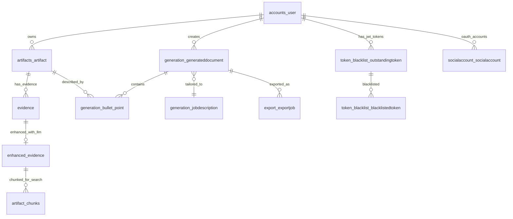

# Tech Spec — System

**Version:** v1.4.0
**File:** docs/specs/spec-system.md
**Status:** Current
**PRD:** `prd.md`
**Contract Versions:** API v4.1 • Schema v1.2 • Prompt Set v1.0
**Git Tags:** `spec-system-v1.4.0` 

## Table of Contents
- [Overview & Goals](#overview--goals)
- [Architecture (Detailed)](#architecture-detailed)
  - [Topology (Production AWS Infrastructure)](#topology-production-aws-infrastructure)
  - [Component Inventory](#component-inventory)
- [Interfaces & Data Contracts](#interfaces--data-contracts)
  - [Core API Endpoints](#core-api-endpoints)
  - [Data Schema Versions](#data-schema-versions)
  - [Error Taxonomy](#error-taxonomy)
- [Data & Storage](#data--storage)
  - [Primary Tables](#primary-tables)
  - [Entity Relationship Diagram](#entity-relationship-diagram)
  - [Indexes and Performance](#indexes-and-performance)
  - [Migrations and Retention](#migrations-and-retention)
- [Reliability & SLIs/SLOs](#reliability--slisslos)
  - [Service Level Indicators](#service-level-indicators)
  - [Service Level Objectives](#service-level-objectives)
  - [Reliability Mechanisms](#reliability-mechanisms)
- [Security & Privacy](#security--privacy)
  - [Network Security & Transport Layer](#network-security--transport-layer)
  - [Authentication & Authorization](#authentication--authorization)
  - [Data Protection](#data-protection)
  - [Audit and Logging](#audit-and-logging)
- [Evaluation Plan](#evaluation-plan)
  - [Test Datasets](#test-datasets)
  - [Quality Metrics](#quality-metrics)
  - [Test Harness](#test-harness)
- [Rollout & Ops Impact](#rollout--ops-impact)
  - [Feature Flags](#feature-flags)
  - [Rollout Strategy](#rollout-strategy)
  - [Monitoring Dashboards](#monitoring-dashboards)
  - [Alerting](#alerting)
- [Risks & Rollback](#risks--rollback)
  - [Technical Risks](#technical-risks)
  - [Business Risks](#business-risks)
  - [Rollback Plan](#rollback-plan)
- [Deployment Documentation](#deployment-documentation)
- [Open Questions](#open-questions)

## Overview & Goals

Build a comprehensive CV & Cover-Letter Auto-Tailor system that enables job seekers to upload work artifacts with evidence links and generate targeted, ATS-optimized career documents. Target CV generation ≤30s, ATS pass rate ≥65%, and support for 10,000 concurrent users with 1M+ stored artifacts.

Links to latest PRD: `docs/prds/prd.md`

## Architecture (Detailed)

### Topology (Production AWS Infrastructure)

```
┌─────────────────────────────────────────────────────────────────────────┐
│                          Public Internet                                │
│                        (Users + External APIs)                          │
└────────────────┬────────────────────────────────┬───────────────────────┘
                 │ HTTPS                          │ HTTPS
                 │ (TLS 1.2+)                     │ (ACM Cert)
┌────────────────▼────────────────┐   ┌──────────▼───────────────────────┐
│   CloudFront CDN                │   │   Application Load Balancer      │
│   <YOUR_DOMAIN>              │   │   api.<YOUR_DOMAIN>          │
│   [Frontend Distribution]       │   │   [Backend Ingress]             │
│   • Custom domain (Route 53)    │   │   • Custom domain (Route 53)    │
│   • ACM certificate             │   │   • ACM certificate             │
│   • Edge caching (global)       │   │   • Health checks + SSL term    │
└────────────────┬────────────────┘   └──────────┬───────────────────────┘
                 │                                │ HTTP
                 │ S3 Static Files                │ (VPC internal)
┌────────────────▼────────────────┐   ┌──────────▼───────────────────────┐
│   S3 Bucket                     │   │   ECS Fargate Cluster           │
│   cv-tailor-frontend-prod       │   │   [Backend Containers]          │
│   • React build artifacts       │   │   • Django + Gunicorn + uv      │
│   • Vite production bundle      │   │   • Auto-scaling 2-10 tasks     │
└─────────────────────────────────┘   │   • VPC private subnets         │
                                      └──────────┬───────────────────────┘
                                                 │
                                      ┌──────────▼───────────────────────┐
                                      │   ElastiCache Redis Cluster      │
                                      │   (Cache + Session + Celery)     │
                                      │   • Primary + replica            │
                                      │   • VPC private subnets          │
                                      └──────────┬───────────────────────┘
                                                 │ Queue Jobs
                                      ┌──────────▼───────────────────────┐
                                      │   Celery Workers (ECS Tasks)     │
                                      │  ┌──────────────┬──────────────┐ │
                                      │  │   Artifact   │   Generation │ │
                                      │  │   Processor  │    Service   │ │
                                      │  │  (Python+uv) │  (Python+uv) │ │
                                      │  └──────────────┼──────────────┘ │
                                      └─────────────────┼──────────────────┘
                                                        │
                                                        │ LLM API + DB Access
                                                        │
┌───────────────────────────────────────────────────────▼───────────────────┐
│                     RDS PostgreSQL 15 (Multi-AZ)                          │
│  ┌─────────────┬─────────────┬─────────────┬─────────────────────────┐  │
│  │ Users       │ Artifacts   │ Evidence    │ Generated Documents     │  │
│  │ & Auth      │ & Labels    │ Links       │ & Versions              │  │
│  │ (accounts_user) │ (artifacts) │ (evidence)  │ (generation_*)          │  │
│  └─────────────┴─────────────┴─────────────┴─────────────────────────┘  │
│  • Primary + read replica         │  • VPC private subnets              │
│  • Automated backups (30 days)    │  • Connection pooling               │
└───────────────────────────────────┴─────────────────────────────────────┘

┌───────────────────────────────────────────────────────────────────────────┐
│                         External LLM Provider                             │
│                           (OpenAI GPT-5 API)                              │
│                       [External Trust Boundary]                          │
│  • TLS 1.2+ encrypted connections  │  • API key via AWS Secrets Manager │
└───────────────────────────────────────────────────────────────────────────┘
```

### Component Inventory

| Component | Framework/Runtime | Purpose | Interfaces (in/out) | Depends On | Scale/HA | Owner |
|-----------|------------------|---------|-------------------|------------|----------|-------|
| CloudFront CDN | AWS CloudFront | Global CDN for frontend, SSL termination, edge caching | In: HTTPS from users (<YOUR_DOMAIN>); Out: S3 static files | S3, Route 53, ACM | Multi-region edge locations, 99.9% SLA | DevOps |
| Frontend Assets | S3 Bucket + React Build | Static SPA assets (HTML, JS, CSS) from Vite build | In: CloudFront requests; Out: Static files | CloudFront | Regional replication, 99.99% durability | Frontend |
| ALB (API Gateway) | AWS Application Load Balancer | Backend API ingress, SSL termination, health checks | In: HTTPS (api.<YOUR_DOMAIN>); Out: HTTP to ECS tasks | ECS, Route 53, ACM | Multi-AZ, auto-healing | DevOps |
| ECS Fargate (Backend) | Django + Gunicorn + uv | Containerized backend API, request routing, auth | In: HTTP from ALB; Out: DB, Redis, Celery | RDS, ElastiCache, ALB | Auto-scaling 2-10 tasks, ECS service | Backend |
| Auth Service | Django (built-in auth + django-allauth) | User authentication, JWT, OAuth, password reset | In: Login/logout/OAuth requests; Out: JWT tokens, Redis session | ElastiCache, RDS, Google OAuth | Stateless, embedded in ECS tasks | Backend |
| Core API | Django DRF | Artifact CRUD, matching, generation orchestration | In: REST API calls; Out: DB queries, Celery tasks | RDS, ElastiCache, Celery | Stateless, auto-scale with ECS | Backend |
| Export Service | Django + ReportLab/python-docx | PDF/Docx generation and formatting | In: Document data; Out: Binary files to S3 | RDS, S3 | CPU-intensive, separate ECS service | Backend |
| Dependency Manager | uv | Python package and environment management | In: pyproject.toml; Out: Isolated Python environments | Python runtime | Container build-time tool | Backend |
| ElastiCache Redis | AWS ElastiCache (Redis 7) | Session cache, API cache, Celery broker | In: Cache ops, queue ops; Out: Data retrieval | - | Primary+replica, Multi-AZ | DevOps |
| ECS Celery Workers | Celery (Python + uv) in ECS | Async processing of artifacts and CV generation | In: Queue messages from Redis; Out: DB updates, LLM calls | ElastiCache, RDS, OpenAI API | Auto-scale by queue depth (ECS) | Backend |
| Artifact Processor | Python (Celery worker + uv) | Parse uploads, extract metadata, validate evidence | In: Upload tasks; Out: Structured artifact data | RDS, External APIs | Scales independently in ECS | Backend |
| Generation Service | Python (Celery worker + uv) | CV/cover letter content generation, bullet validation | In: Generation tasks; Out: Generated content | OpenAI API, RDS | Rate-limited by LLM API quota | Backend |
| RDS PostgreSQL | AWS RDS PostgreSQL 15 | Primary data storage for all entities | In: SQL queries from ECS; Out: Query results | - | Multi-AZ, automated backups, read replicas | DevOps |
| AWS Secrets Manager | AWS Secrets Manager | Secure storage and rotation of credentials | In: Secret requests from ECS; Out: DB passwords, API keys | - | Regional service, 99.9% SLA | DevOps |
| LLM Provider | OpenAI GPT-5 API | Content generation, parsing, matching, bullet quality | In: HTTPS requests; Out: Generated text/analysis | - | External SLA dependency, circuit breaker | Backend |

## Interfaces & Data Contracts

### Core API Endpoints

**Implemented:**
- **Authentication** (10 endpoints): Registration, login/logout, token management, profile CRUD, Google OAuth (link/unlink)
  - Base path: `/api/v1/auth/`
  - Key endpoints: `POST register/`, `POST login/`, `POST google/`, `GET/PATCH profile/`
- **Artifacts** (15 endpoints): Upload, CRUD, enrichment, evidence links, suggestions, validation
  - Base path: `/api/v1/artifacts/`
  - Key operations: CRUD, `POST {id}/enrich/`, `GET {id}/enrichment-status/`, `POST {id}/evidence-links/`, `POST suggest-for-job/`
- **Evidence Links** (3 endpoints): Add, update, delete evidence (integrated with Artifacts API)
  - Base paths: `POST /api/v1/artifacts/{id}/evidence-links/`, `GET/PUT/PATCH/DELETE /api/v1/artifacts/evidence-links/{id}/`
- **Generation** (15 endpoints): Create CV/cover letter, bullets (ft-006), templates, analytics, rating
  - Base path: `/api/v1/generations/`
  - Key operations: `POST create/`, `POST cover-letter/`, `GET/POST {id}/bullets/`, `POST {id}/bullets/approve/`, `POST {id}/assemble/`
- **Export** (7 endpoints): Templates, create export, status, download, analytics
  - Base path: `/api/v1/export/`
  - Key operations: `POST create/{generation_id}/`, `GET {id}/status/`, `GET {id}/download/`, `GET templates/`

**Complete API Specification:** See `docs/specs/spec-api.md` for detailed endpoint signatures, request/response schemas, authentication requirements, error codes, and full endpoint listing. Summary above reflects implemented status as of v1.4.0.

### Data Schema Versions

- **API Schema v2.0:** RESTful endpoints with JWT authentication and user profiles
- **Database Schema v1.1:** Extended User model with comprehensive profile fields; PostgreSQL 15
- **LLM Prompt Schema v1.0:** Structured prompts for parsing, matching, generation

### Error Taxonomy

- 400: Invalid request data (malformed JSON, missing required fields)
- 401: Authentication required
- 403: Insufficient permissions
- 404: Resource not found
- 422: Business logic validation failure (invalid file type, broken evidence link)
- 429: Rate limit exceeded
- 500: Internal server error
- 502: External service (LLM) unavailable
- 503: Service temporarily unavailable (maintenance)

## Data & Storage

### Primary Tables

#### Implemented
- `accounts_user` - Extended Django user model (Django convention: {app}_{model})
- `token_blacklist_blacklistedtoken` - JWT token blacklist for secure logout
- `token_blacklist_outstandingtoken` - Outstanding JWT refresh tokens for rotation
- `socialaccount_socialaccount` - Social authentication accounts (django-allauth)
- `socialaccount_socialtoken` - OAuth tokens for social accounts
- `artifacts_artifact` - Work projects with metadata, enrichment fields (ft-005)
- `evidence` - Evidence links (GitHub repos, PDF uploads) with validation status
- `generation_jobdescription` - Parsed job descriptions with requirements and company signals
- `generation_generateddocument` - Generated CVs and cover letters with metadata
- `generation_skillstaxonomy` - Normalized skill taxonomy with aliases and related skills
- `generation_bullet_point` - Bullet points for CVs with quality scores (ft-006)
- `generation_bullet_generation_job` - Async bullet generation jobs with retry logic (ft-006)
- `enhanced_evidence` - LLM-processed evidence with structured content (llm_services)
- `model_performance_metrics` - LLM API performance tracking (llm_services)
- `circuit_breaker_states` - Circuit breaker state management (llm_services)

#### Planned
- `labels` - Reusable role-theme tags grouping artifacts and skills
- `export_logs` - Track which evidence links were included in exports
- `llm_processing_log` - Audit log for LLM API calls and token usage

### Entity Relationship Diagram

**High-level architecture diagram** showing key relationships between major table groups:



**Architecture Notes:**
- **User-Centric:** All data is owned by accounts_user with strict user_id partitioning
- **Artifact → Evidence → Enhanced:** Processing pipeline from raw artifacts to LLM-enriched content
- **Generation Pipeline:** Job descriptions drive artifact selection and bullet generation
- **JWT Security:** Token blacklist supports secure logout and token rotation

**Complete Database Schema:** See `docs/specs/spec-database-schema.md` for:
- Exhaustive field-level documentation for all 40+ tables
- Complete Mermaid ERD with all relationships and field types
- Detailed schema notes and constraints
- Table group descriptions (Authentication, Artifacts, Generation, Export, LLM Reliability)

### Indexes and Performance

**Implemented Indexes:**
- `accounts_user.email`, `accounts_user.username` - Authentication lookups (unique constraints)
- `token_blacklist_blacklistedtoken.token_id` - Token blacklist lookup

**Planned Indexes:**
- `artifacts.user_id, created_at` - User artifact listing
- `generated_documents.user_id, job_description_hash` - Document caching

**Source of Truth:** See `backend/*/migrations/` for complete index definitions and Django model Meta classes for database constraints.

### Migrations and Retention

**Completed:**
- Extended User model with profile fields, JWT token blacklist, Google OAuth integration
- PostgreSQL migration (development and production)

**Planned Retention Policies:**
- Evidence validation: 30-day rolling, Generated documents: 90-day (unless saved), LLM logs: 30-day detailed / 2-year aggregated

**Source of Truth:** See Django settings (`backend/cv_tailor/settings/base.py`) for retention configuration and `backend/*/migrations/` for migration history.

## Reliability & SLIs/SLOs

### Service Level Indicators

- **Availability:** Uptime percentage (excluding planned maintenance)
- **Latency:** P95 response time for CV generation
- **Error Rate:** 5xx error percentage
- **Evidence Link Health:** Percentage of working evidence links
- **LLM API Success Rate:** Percentage of successful LLM API calls

### Service Level Objectives

- **Availability:** ≥99.5% during business hours (6 AM - 10 PM user timezone)
- **CV Generation Latency:** P95 ≤30 seconds end-to-end
- **Cover Letter Generation:** P95 ≤15 seconds
- **Error Rate:** ≤1% for user-facing endpoints
- **Evidence Link Validation:** ≥95% working links maintained
- **LLM Generation Success Rate:** ≥95% for valid inputs
- **Content Processing Latency:** P95 <30s for PDF extraction
- **Embedding Generation:** P95 <5s per artifact

### Reliability Mechanisms

- **Circuit Breaker:** LLM API calls with 5 consecutive failures threshold (30s timeout)
- **Retry Logic:** Exponential backoff for transient failures (3 retries max)
- **Rate Limiting:** 1000 requests/hour per authenticated user, 100/hour for anonymous users
- **Graceful Degradation:** Template-based generation if LLM unavailable
- **Health Checks:** Deep health checks for all dependencies
- **Provider Failover:** Multi-provider LLM support (OpenAI, Anthropic) with automatic failover
- **Database Replication:** Primary + read replicas for query distribution
- **Caching Strategy:** Redis for LLM responses (1 hour TTL), session data, queue management

**Source of Truth:** See `backend/llm_services/services/reliability/` for circuit breaker implementation and `backend/cv_tailor/settings/base.py` for rate limiting and caching configuration.

## Security & Privacy

### Production Security Architecture

- **Transport Security:** TLS 1.2+ enforced (CloudFront + ALB with ACM certificates)
- **Custom Domains:** HTTPS-only for <YOUR_DOMAIN> (frontend) and api.<YOUR_DOMAIN> (backend)
- **Security Headers:** HSTS, X-Frame-Options, CSP, XSS protection (CloudFront response policy)
- **CORS:** Strict origin whitelisting for production domains, credentials allowed
- **Authentication:** JWT tokens (60m access, 7d refresh) with Redis blacklist for secure logout
- **OAuth:** Google OAuth 2.0 via django-allauth with PKCE
- **Authorization:** Django role-based permissions (user, admin) with user_id data isolation
- **Secrets Management:** AWS Secrets Manager for production credentials, .env for development
- **Data Protection:** RDS encryption at rest, TLS 1.2+ in transit, PII sanitization before LLM processing
- **API Security:** Rate limiting (1000 req/hour per authenticated user, 100/hour for anonymous), input validation (Zod schemas), CSRF protection
- **Audit Logging:** CloudWatch logs with 30-day retention, structured JSON format, correlation IDs
- **Monitoring:** CloudWatch metrics, alarms, and dashboards for security events

**Development Environment:**
- HTTP only (localhost:3000, localhost:8000)
- Wildcard CORS allowed for convenience
- .env files for secrets (git-ignored)

**Comprehensive Security Documentation:**
- **Frontend security:** `docs/security/frontend-security.md` (XSS prevention, CSP, input validation)
- **Backend security:** `docs/security/backend-security.md` (Django hardening, HTTPS enforcement)
- **CloudFront headers:** `docs/deployment/cloudfront-security-headers.md` (CDN security configuration)
- **Security score:** 8.9/10 (as of October 2025)

**Source of Truth:** See Django settings (`backend/cv_tailor/settings/`) for authoritative security configurations including CORS, HTTPS enforcement, session management, and rate limiting.

## Evaluation Plan

### Test Datasets

- **Golden CV Examples:** 100 high-quality CVs across different roles
- **Job Description Corpus:** 500 JDs from various companies and roles
- **Evidence Link Test Set:** 1000 validated links of different types
- **ATS Compatibility Suite:** Test exports against 10 major ATS systems
- **Artifact Processing Set:** 50 artifacts across PDF, GitHub, web formats

### Quality Metrics

- **Content Relevance:** User ratings ≥8/10 for generated content
- **Evidence Accuracy:** ≥95% evidence links remain valid
- **ATS Pass Rate:** ≥65% compatibility across test ATS systems
- **Keyword Matching:** ≥85% of critical JD keywords included appropriately
- **Content Extraction Accuracy:** 90% accuracy vs. manual review
- **Relevance Ranking Quality:** 15% improvement in user satisfaction over keyword matching
- **LLM Quality Score:** ≥8/10 average user rating

### Test Harness

- **Automated Regression:** Daily runs against golden dataset
- **Performance Testing:** Load testing for 10,000 concurrent users
- **Integration Testing:** End-to-end user journey validation
- **Security Testing:** Regular penetration testing and vulnerability scans
- **LLM Evaluation:** Automated quality metrics on golden datasets with thresholds

## Rollout & Ops Impact

**Feature Management:** Feature flags control artifact upload, CV/cover letter generation, export formats, LLM features (content extraction, summarization, semantic ranking), and OAuth. See individual feature specs for detailed flag configurations.

**Rollout Strategy:** Phased deployment (Phase 0: Infrastructure migration → Phase 1: Beta with auth → Phase 2: Gradual LLM features → Phase 3: Full production). See `docs/deployment/rollout-strategy.md` for traffic splitting, canary deployments, and phase gate criteria.

**Monitoring:** CloudWatch dashboards track user metrics (registrations, generations), performance (latency, queue depth), quality (error rates, user ratings), business KPIs (conversion, retention), and LLM metrics (token usage, costs, provider health).

**Alerting:** Critical alerts (service down, DB unreachable, LLM failures), Warning alerts (high latency, elevated errors, cost spikes), Info alerts (daily summaries, weekly reports). See `docs/deployment/monitoring-alerts.md` for alert thresholds and escalation procedures.

## Risks & Rollback

### Technical Risks

1. **LLM API Rate Limits/Costs** → Mitigation: Caching, request optimization, multi-provider failover, daily spend limits
2. **Evidence Link Degradation** → Mitigation: Regular validation, archive.org fallbacks, user notifications
3. **Database Performance** → Mitigation: Read replicas, query optimization, connection pooling, database indexes
4. **User Data Privacy** → Mitigation: Encryption, access controls, audit logging, PII sanitization
5. **PostgreSQL Migration Complexity** → Mitigation: Phased migration, extensive testing, rollback plan, data validation
6. **Vector Search Scalability** → Mitigation: Index tuning, query optimization, separate read replicas for embeddings

### Business Risks

1. **Poor Content Quality** → Mitigation: Human review loops, user feedback integration, A/B testing
2. **ATS Compatibility Issues** → Mitigation: Regular ATS testing, format variations, user feedback
3. **User Adoption** → Mitigation: Onboarding optimization, user research, feature education
4. **Competitive Pressure** → Mitigation: Unique evidence-linking differentiator, LLM-powered quality
5. **LLM Cost Overruns** → Mitigation: Token usage optimization, caching strategy, user limits

### Rollback Plan

- **Feature Flags:** Immediate disable of problematic features
- **Database Rollback:** Point-in-time recovery for data issues
- **Code Rollback:** Blue-green deployment for rapid version reversion
- **Data Migration Rollback:** Reversible migrations with validation
- **LLM Fallback:** Degrade to keyword matching if LLM unavailable
- **Provider Switching:** Automatic failover between LLM providers

## Deployment Documentation

Comprehensive deployment guides and operational procedures are available:

**Quick Start & Overview:**
- `docs/deployment/README.md` - Deployment guide overview and decision tree

**Environment-Specific Guides:**
- `docs/deployment/local-development.md` - Day-to-day local Docker development
- `docs/deployment/testing-environments.md` - How to test multi-environment settings
- `docs/deployment/staging-deployment.md` - Deploy to AWS staging with Terraform
- `docs/deployment/production-deployment.md` - Production deployment procedures

**Infrastructure & Security:**
- `docs/specs/spec-deployment-v1.0.md` - Complete AWS architecture specification (18,000 words)
- `docs/security/frontend-security.md` - Frontend security analysis and recommendations
- `docs/deployment/cloudfront-security-headers.md` - CloudFront security headers setup

**Infrastructure as Code:**
- `terraform/` - Terraform modules for AWS infrastructure provisioning
- `.github/workflows/` - GitHub Actions for CI/CD pipelines

## Open Questions

1. **LLM Provider Selection:** OpenAI (current choice) for all use cases; multi-provider considered for future
2. **Evidence Validation Frequency:** Real-time vs batch validation trade-offs
3. **User Data Export:** Scope and format for GDPR compliance
4. **Integration Strategy:** Priority order for job board and LinkedIn integrations
5. **Monetization Impact:** How pricing tiers affect technical architecture
6. **Content Retention:** Cache duration for LLM-processed content vs reprocessing costs
7. **AWS Cost Optimization:** Right-sizing ECS tasks, RDS instance types, ElastiCache nodes

## References

### Related Technical Specs
- **spec-api.md** - Backend API detailed contracts and request/response schemas
- **spec-frontend.md** - React frontend architecture and component design
- **spec-llm.md** - LLM integration, prompts, and anti-hallucination architecture
- **spec-database-schema.md** - Complete database schema with field-level documentation
- **spec-deployment-v1.0.md** - Comprehensive AWS infrastructure specification

### Deployment Documentation
- **docs/deployment/README.md** - Deployment guide overview and decision tree
- **docs/deployment/local-development.md** - Day-to-day local Docker development
- **docs/deployment/current-deployment.md** - Live production status and resource IDs
- **docs/deployment/architecture.md** - Infrastructure diagrams and component relationships
- **docs/deployment/production-deployment.md** - Production deployment procedures
- **docs/deployment/troubleshooting.md** - Common deployment issues and solutions

### Security Documentation
- **docs/security/backend-security.md** - Django security configurations and HTTPS enforcement
- **docs/security/frontend-security.md** - React security analysis and XSS prevention
- **docs/deployment/cloudfront-security-headers.md** - CDN security headers configuration

### Product Requirements
- **docs/prds/prd.md** - Product requirements and user stories
